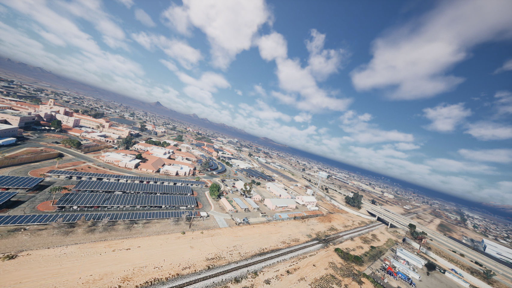
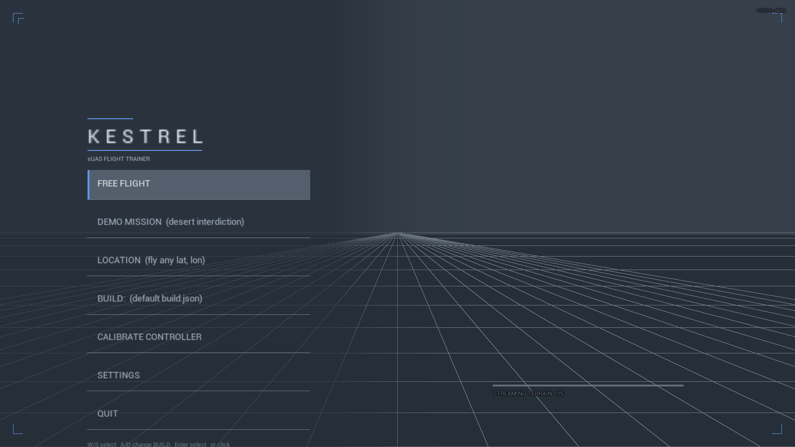
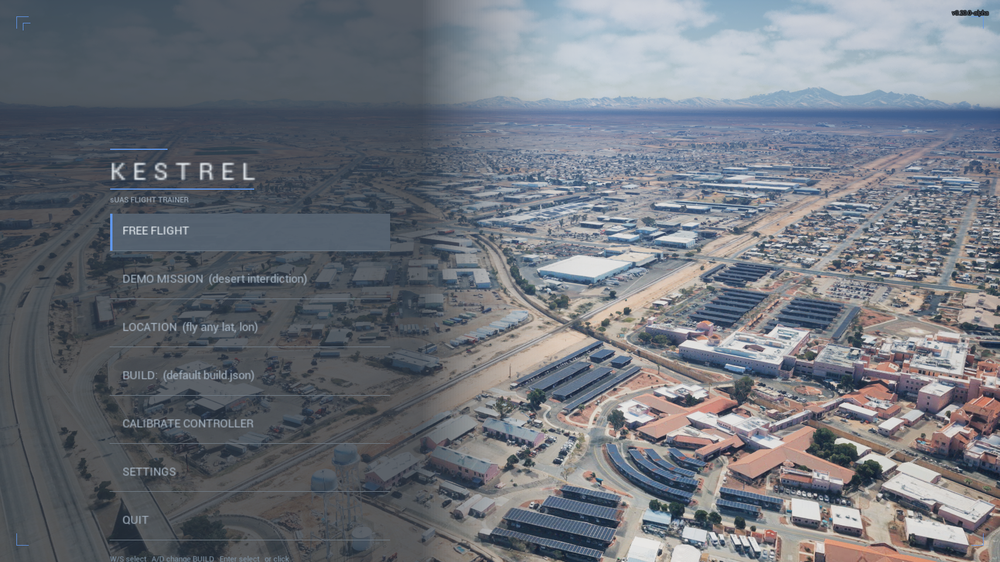
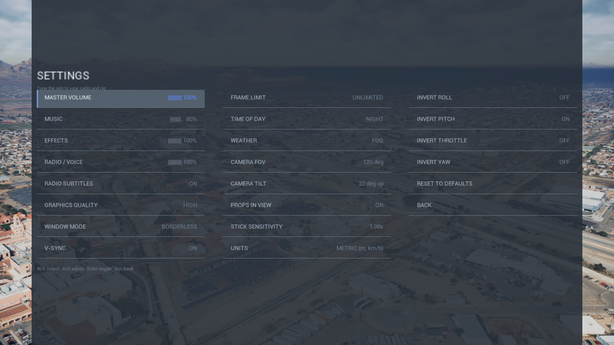
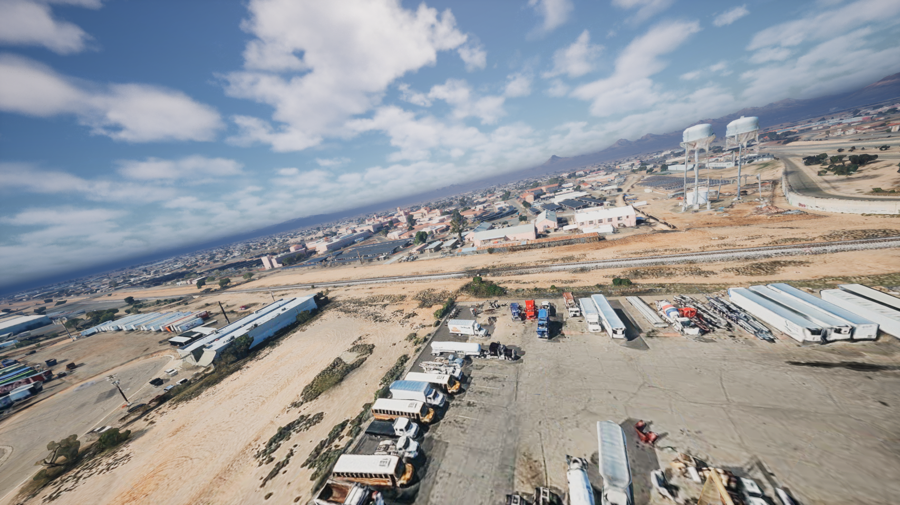

<div align="center">

# K E S T R E L

**An FPV drone sim you can fly at any coordinate on Earth.**

[**Download →**](../../releases/latest)

*Free · Windows x64 · alpha*

</div>


<div align="center"><sub>Industrial flats · banked over structures · Times Square · desert badlands — all real coordinates, streamed live.
<a href="../../releases/latest">Full trailer in the release assets</a></sub></div>

Type in a grid or drop a pin, and that exact spot loads in photoreal terrain —
the same imagery as Google Earth. Build a quad out of real parts and it flies
like those parts: real motor KV, real prop, real pack. Betaflight rates and a
Betaflight OSD, on your own radio.

The point is stick time without burning packs, props, or airspace.

> **This is an alpha and it is rough.** It will crash on you. Bug reports are
> automatic and they genuinely help — see below.



---

## Get it running

1. [**Download**](../../releases/latest) `KESTREL-alpha-win64.zip` and unzip it
   **to its own folder**.
2. Run **`KESTREL.exe`**. That is the only thing to click — no install, no
   account. Terrain works out of the box.
   SmartScreen will warn (unsigned build) → *More info* → *Run anyway*.
3. If it will not start, run the bundled **`vc_redist.x64.exe`** once. A missing
   Microsoft C++ runtime is the usual cause.
4. **CALIBRATE CONTROLLER → AUTO-DETECT → SAVE → BACK.**
5. **LOCATION** → drop a pin, or type `40.7580, -73.9855` → fly.
   Throttle down, then Enter (or your mapped switch) to arm.

Needs internet for terrain streaming. Keyboard and gamepad work, but a radio in
USB-Joystick mode is the point.

---

## What is actually modelled

- **Any coordinate on Earth.** Drop a pin, or type MGRS or `lat, lon`. Ground
  elevation gets looked up and the world calibrates against the streamed
  terrain, so you spawn on the actual street.
- **Physics from real parts.** Mass, KV, cells, capacity, prop size. Motors top
  out at the spec sheet's *loaded* rated point, not an impossible no-load
  number, so thrust-to-weight and the feel of weight are honest. Checked against
  a separate reference model with 125 tests.
- **Batteries behave.** Nonlinear LiPo discharge, IR sag, a real voltage cliff.
  Fly the pack down and it browns out — it falls out of the sky.
- **The link is real.** RSSI comes from actual distance *and* line-of-sight
  through the terrain geometry. Get a building between you and the quad at range
  and the video tears and snows, then you lose it.
- **Time of day and weather.** Real solar position for wherever and whenever you
  are flying — dawn in Tucson is actually dawn in Tucson. Wind acts on airspeed,
  so you crab into it. Density altitude is fed to the physics.
- **Damage sticks.** Impacts crack the camera, kill individual motors, or write
  the airframe off. Nothing is on a timer.

---

## Screens

| | |
|---|---|
|  |  |
| Title, while terrain streams in. | Front end, over the live area. |
|  |  |
| Audio, display, environment, flight. | Low pass over real streets. |

---

## When it breaks

**Reporting is automatic.** Crashes write their own report, and **F12** grabs one
on any screen. It all lands in:

```
Documents\KESTREL\reports\
```

Zip that folder and send it — or just open an
[issue](../../issues) here and drag it in. That is everything needed; you do not
have to write it up well.

If you would rather just describe it, three things help most:
1. **Version** — printed top-right on screen.
2. **What you did** — "hit RANDOM AO", "mapped a switch to arm and flipped it".
3. **What happened** vs. what you expected.

Known issues ship in `CHANGELOG.md` inside the zip.

---

## Requirements

| | Minimum | Recommended |
|---|---|---|
| OS | Windows 10 64-bit (1909+) | Windows 11 64-bit |
| CPU | Quad-core 2.5 GHz (i5-8400 / Ryzen 5 2600) | 6-core 3.5 GHz+ |
| RAM | 8 GB | 16 GB |
| GPU | DirectX 12, 4 GB VRAM (GTX 1060 / RX 580) | RTX 2060 / RX 5700+ |
| Disk | 2 GB free | — |
| Controller | Radio in USB-Joystick mode (RadioMaster / EdgeTX / TBS) | Radio |

You need a **discrete GPU** — UE5 will not run acceptably on integrated
graphics. Windows x64 only for now.

---

<sub>Built in Unreal Engine 5. Source is private; this repo is releases and docs.
Terrain © Google via Cesium ion · map imagery © Esri.</sub>
