<div align="center">

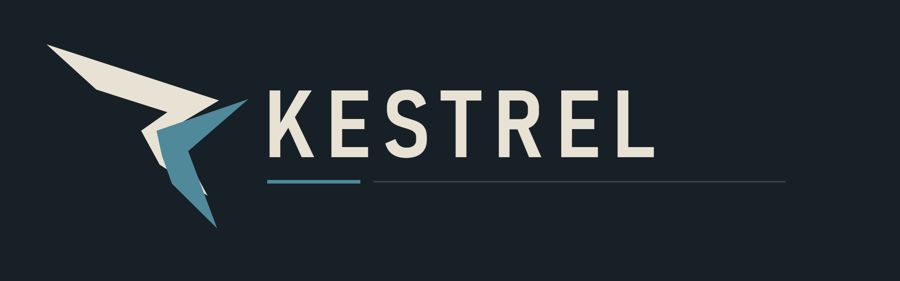

**Small UAS mission simulation at any coordinate on Earth.**

[**Download →**](../../releases/latest)

*Free · Windows x64 · alpha*

</div>

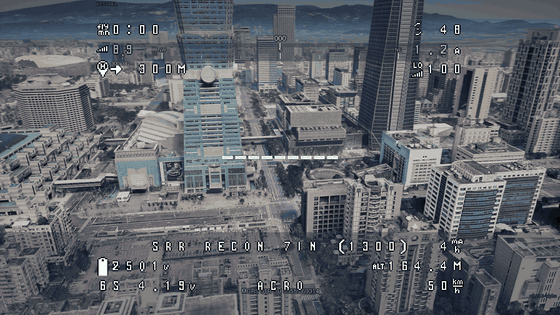

<div align="center"><sub>Drop a pin anywhere on Earth and that coordinate loads in photoreal terrain. Build the aircraft from real parts, drop the objective on real ground, and fly the mission you just made.</sub>

[**▶ Watch the full trailer with sound**](https://github.com/nbschultz97/kestrel/releases/download/v0.29.1-alpha/kestrel-trailer-v9.mp4) · [LinkedIn 35 s cut](https://github.com/nbschultz97/kestrel/releases/download/v0.29.1-alpha/kestrel-short-linkedin.mp4) · [Vertical 60 s](https://github.com/nbschultz97/kestrel/releases/download/v0.29.1-alpha/kestrel-short-vertical.mp4)</div>

Choose a training mission, type in a grid, or drop a pin, and that exact area
loads in photoreal terrain. Build an aircraft from real parts and it flies like
those parts: real motor KV, prop, pack, and mass. Import a Betaflight diff to
train on your own rates, tune, modes, and switches; the OSD uses the stock
Betaflight MAX7456 character set—the same glyphs a real analog OSD chip draws.

The point is repeatable mission rehearsal and honest stick time without burning
packs, props, or airspace.

> **This is an alpha and it is rough.** It will crash on you. Bug reports are
> automatic and they genuinely help — see below.

---

## Current unsigned release — v0.42.3-alpha-unsigned.1

The current public v0.42.3 package is explicitly **unsigned**. The **Download**
link above, [versioned release page](../../releases/tag/v0.42.3-alpha-unsigned.1),
`releases/latest`, and the in-app updater all resolve to this same artifact.
The official KESTREL repository, Rotopter, and MilGit carry the same release
metadata and ZIP identity so no release mirror advertises different bytes.

This package is for approved test environments only. Neither `KESTREL.exe` nor
`CeradonSim/Binaries/Win64/CeradonSim.exe` has an Authenticode signature, so
Windows SmartScreen, Smart App Control, or organization policy may warn or
block it. Do not weaken endpoint policy to run it; wait for the signed release
if the test environment does not explicitly permit unsigned software.

- Source commit: `bac24999010eb99f5117cf7591643f15e1bc87ec`
- Archive size: `673,203,991` bytes
- SHA-256: `c3fea9c8ae330908302060e026db318b173a9d20fe422d8f09f3c9498cb38cbf`

Launcher 1.1 compares only the numeric `major.minor.patch` portion of a version.
After installing this build, a later signed auto-update must therefore be
v0.42.4 or newer; reusing v0.42.3 would compare equal and would not be offered.

See the [release notes](RELEASE_NOTES.md#kestrel-v0423-alpha-unsigned1--current-unsigned-release)
for the changes, verification record, and known limitations.

---

## Previous release — v0.40.1-alpha

v0.40.1 is the stabilization build for the v0.40 mission, aircraft-art, and
startup pass:

- The shipped identity is now a restrained angular flight-datum mark and clean
  KESTREL wordmark. Main-menu labels are concise, Work Bench rows say `EDIT` and
  `RENAME`, and Test Range / Proving Ground copy stays inside its cards.
- A Work Bench crash in immediate thumbnail capture is fixed by deferring scene
  capture to Unreal's end-of-frame pass. The packaged 11-screen catalog tour now
  completes without a crash or duplicate report.
- Five 1300 mAh Tattu, CNHL, and GNB products have exact meshes and readable wrap
  art. Thumbnail residency and dark-part compositing were tightened so batteries,
  boards, and carbon do not cache unfinished white/grey frames.
- Mission Builder can author an AO with a procedural bunker tunnel. Recon tasks
  require a fitted camera, real field of view, line of sight, range, and dwell;
  missions are labelled as operations, courses, user missions, or imports.
- The public playtest package deliberately bundles the project's public Cesium
  token, so photoreal terrain works without asking every player to provision one.

See the [full release notes](RELEASE_NOTES.md) for v0.42.3, v0.40.1, v0.40, and
the historical release record.

---

## Get it running

1. [**Download**](../../releases/latest) `KESTREL-alpha-win64.zip` and unzip it
   **to its own folder**.
2. Run **`KESTREL.exe`**. That is the only thing to click — no installer.
   SmartScreen will warn (unsigned build) → *More info* → *Run anyway*.
3. The public playtest token is bundled, so photoreal terrain works on first
   launch. Advanced users can replace **`Documents\KESTREL\cesium_token.txt`**
   with their own scoped Cesium ion token; the updater preserves edited tokens.
4. If it will not start, run the bundled **`vc_redist.x64.exe`** once. A missing
   Microsoft C++ runtime is the usual cause.
5. **CALIBRATE CONTROLLER → AUTO-DETECT → SAVE → BACK.**
6. **FREE FLIGHT** → choose an aircraft → drop a pin, or type
   `40.7580, -73.9855` → fly.
   Throttle down, then Enter (or your mapped switch) to arm.

Needs internet for terrain streaming. Keyboard and gamepad work, but a radio in
USB-Joystick mode is the point.

---

## What is actually modelled

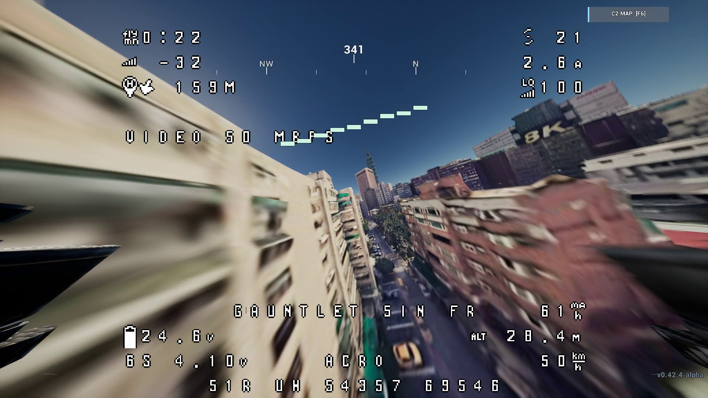

- **Any coordinate on Earth.** Drop a pin, or type MGRS or `lat, lon`. Ground
  elevation gets looked up and the world calibrates against the streamed
  terrain, so you spawn on the actual street.
- **Physics from real parts.** Mass, KV, cells, capacity, prop size. Motors top
  out at the spec sheet's *loaded* rated point, not an impossible no-load
  number, so thrust-to-weight and the feel of weight are honest. Checked against
  a separate reference model with 153 tests.
- **Batteries behave.** Nonlinear LiPo discharge, IR sag, a real voltage cliff.
  Fly the pack down and it browns out — it falls out of the sky.
- **The link is real.** RSSI comes from actual distance *and* line-of-sight
  through the terrain geometry. Get a building between you and the quad at range
  and the video tears and snows, then you lose it.
- **Time of day and weather.** Real solar position for wherever and whenever you
  are flying — dawn in Tucson is actually dawn in Tucson. Wind acts on airspeed,
  so you crab into it. Density altitude is fed to the physics.
- **Damage sticks.** Impacts crack the camera, kill individual motors, or write
  the airframe off. Nothing is on a timer.

---

## Mission training

The mission library now separates operations, handling courses, user missions,
and imports. Camp Williams courses train link discipline, masked ingress,
low-altitude handling, and stand-off observation; **COLUMN HALT** and **DECK
LINE** are operations; **LOW WATER** and **UNDER THE HILL** cover confined-flight
skills. Mission scoring grades the task actually authored—observation, terminal
effect, or course completion—plus time, link discipline, power management, and
crashes, while personal bests persist between sessions.

A `strike` objective is a one-way attack run: fly the terminal dive onto the
target and the warhead functions. Vehicles in the blast are wrecked rather than
despawned, and the feed hands off to an overhead ISR view for assessment.

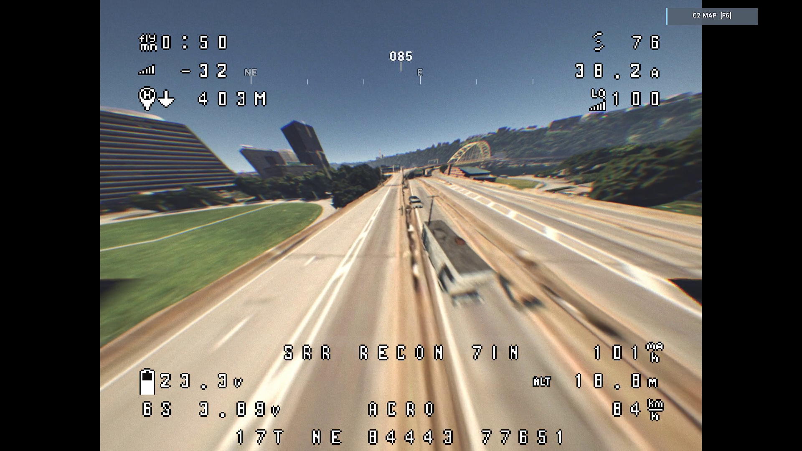

<div align="center"><sub>The warhead functions: live fire, dirt, and a smoke column that builds and drifts — rendered in-engine.</sub></div>

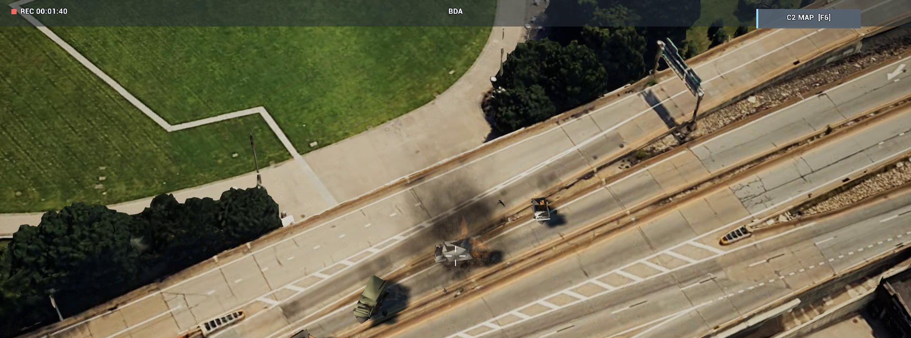

---

## Real time of day

Pick a time and the sky, sun, and lighting move with it — computed from the real
solar position at that coordinate and date, not a canned skybox. Dawn and dusk
are genuine golden hour; noon is hard overhead light; night scales with the real
moon phase, so a new-moon AO is genuinely dark.

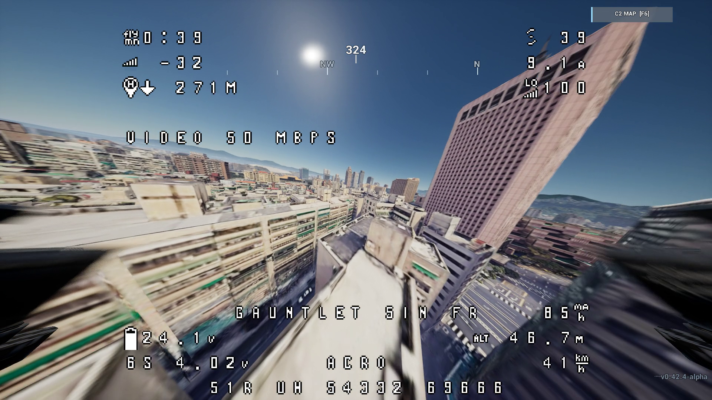

| | |
|---|---|
| 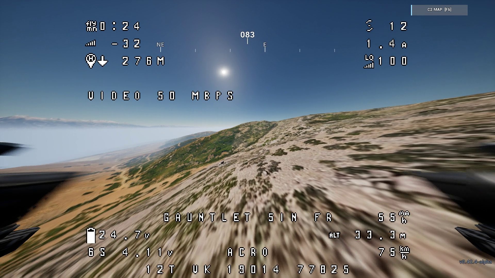 | 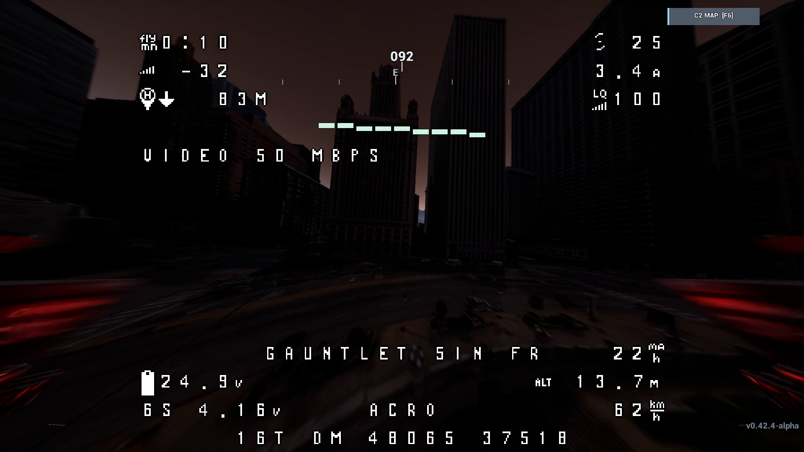 |
| Dawn — terrain flying over the Grand Canyon. | Dusk — golden hour over Lower Manhattan. |
| 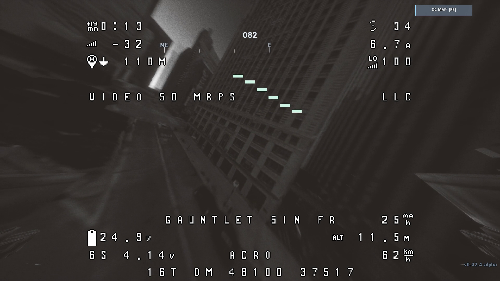 | 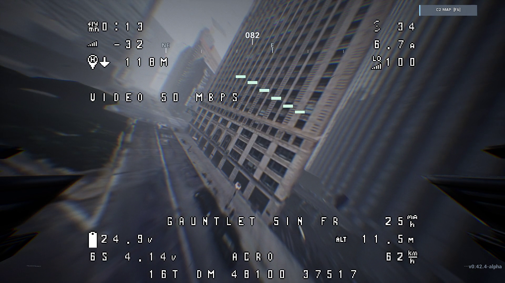 |
| Night — moon-phase lighting over the Strip. | Haze — Dubai Marina in desert air. |

<div align="center"><sub>The real MAX7456 OSD burned in — timer, RSSI, home arrow, battery, alt, speed, MGRS — over photoreal terrain at any time of day, anywhere on Earth.</sub></div>

---

## Screens

| | |
|---|---|
| 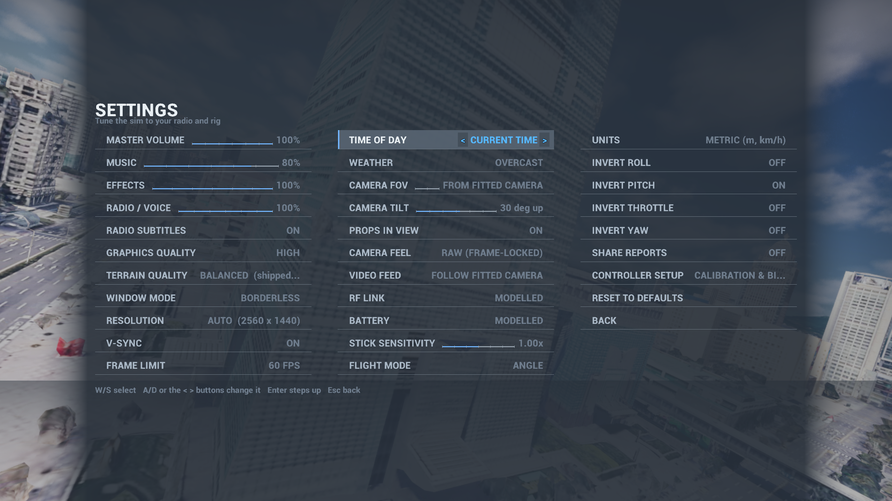 | 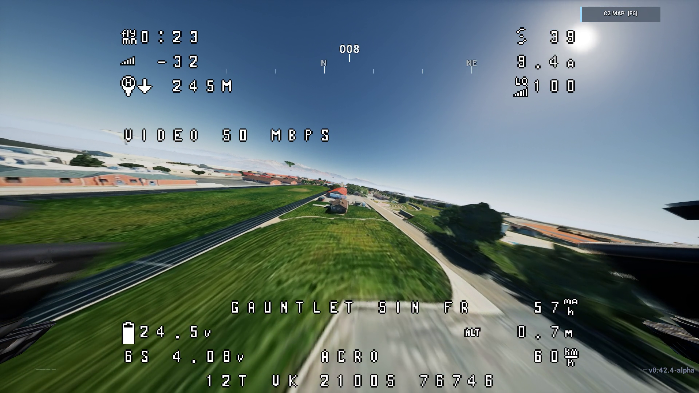 |
| Audio, display, environment, flight. | Low pass over real streets. |

---

## When it breaks

**Reporting is automatic.** Crashes and bugs write their own reports - no
hotkey needed. **F12** toggles a live dev-metrics overlay (audio, flight,
mission state) so you can read off exactly what the sim was doing when
something looked wrong. Reports land in:

```
Documents\KESTREL\reports\
```

Zip that folder and send it — or just open an
[issue](../../issues) here and drag it in. That is everything needed; you do not
have to write it up well.

If you would rather just describe it, three things help most:
1. **Version** — printed top-right on screen.
2. **What you did** — "hit RANDOM AO", "mapped a switch to arm and flipped it".
3. **What happened** vs. what you expected.

Known issues ship in `CHANGELOG.md` inside the zip.

---

## Requirements

| | Minimum | Recommended |
|---|---|---|
| OS | Windows 10 64-bit (1909+) | Windows 11 64-bit |
| CPU | Quad-core 2.5 GHz (i5-8400 / Ryzen 5 2600) | 6-core 3.5 GHz+ |
| RAM | 8 GB | 16 GB |
| GPU | DirectX 12, 4 GB VRAM (GTX 1060 / RX 580) | RTX 2060 / RX 5700+ |
| Disk | 2 GB free | — |
| Controller | Radio in USB-Joystick mode (RadioMaster / EdgeTX / TBS) | Radio |

You need a **discrete GPU** — UE5 will not run acceptably on integrated
graphics. Windows x64 only for now.

---

## License

KESTREL is **free to download and fly, but it is not open source.** The
[KESTREL Evaluation License](LICENSE.txt) covers every copy: free for U.S.
Government personnel for training, familiarization, and evaluation, and free
for personal non-commercial use. No redistribution outside published channels,
no commercial use, and no reverse engineering without a written license —
commercial licensing is available via
[nbschultz97@gmail.com](mailto:nbschultz97@gmail.com).
© 2026 Noah Schultz / Ceradon Systems. All rights reserved.

---

<sub>Built in Unreal Engine 5. Source is private; this repo is releases and docs.
Terrain © Google via Cesium ion · map imagery © Esri.</sub>
