

**Build an aircraft. Choose a location. Practise the flight.**

Windows x64 · Alpha · Proprietary evaluation software

[Download v0.42.12](https://github.com/nbschultz97/kestrel/releases/tag/v0.42.12-alpha-unsigned.1) · [Features](FEATURES.md) · [Changelog](CHANGELOG.md) · [Roadmap](ROADMAP.md)

KESTREL is an Unreal Engine small-UAS flight simulator with a parts-based Work
Bench, saved aircraft, FPV flight, a mission library and editor, and streamed
real-world terrain. It is for simulation and evaluation, not certified navigation,
engineering validation or real-aircraft flight testing.

## Current release

**KESTREL v0.42.12 — September 16, 2026.** A focused display-settings update.
The package identifies itself as v0.42.12-alpha. Earlier releases remain
available under their original tags; the held 0.42.10 candidate is not a public release.

This is an alpha with known defects, not whole-roadmap completion. “Latest”
identifies the download channel, not production certification.

## KESTREL v0.42.12 — display reliability

Display selection and window behavior can now be configured independently.

- Choose **Display** separately from **Window mode**. Auto selects the
  highest-resolution attached panel; a manual choice remembers the monitor.
- Switch between Windowed, Fullscreen and Borderless on the selected screen.
  Windowed sizes fit its usable desktop area, with a native title bar and
  mixed-DPI placement handling.
- Settings changes offer **Keep changes** and **Revert**, with a 15-second
  real-time rollback. Unconfirmed changes do not replace the startup preference.
- Alt+Enter and F11 use the same monitor and sizing logic. On the Settings page
  they request confirmation; outside Settings they keep immediate toggle behavior.

Rendered development and packaged checks passed display transitions, confirmation
and saved-monitor restart on two mixed-DPI screens. The final package also passed
its rendered window-transition, confirmation and saved-monitor restart checks. These are not human drag,
monitor hotplug, physical-radio or live/fully paused-flight shortcut acceptance.

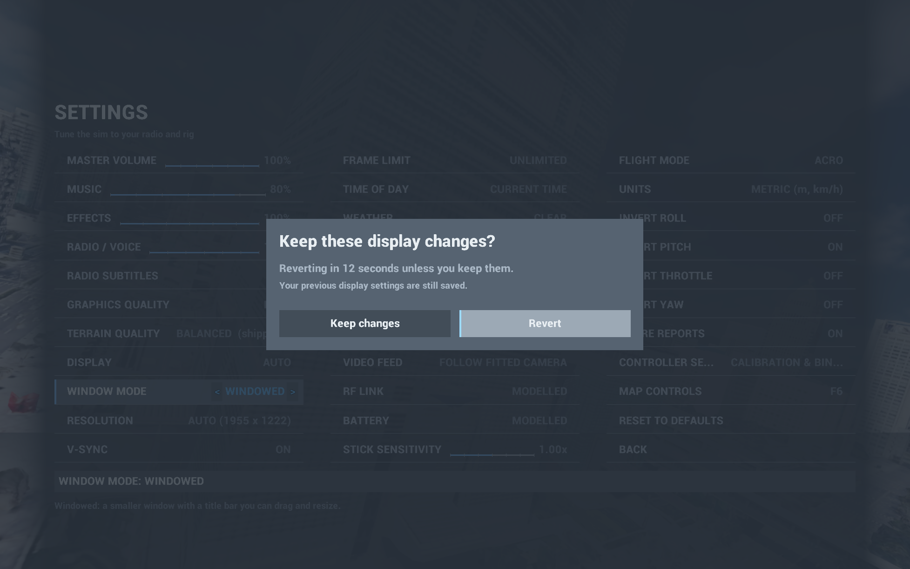

Actual Settings capture from the packaged v0.42.12 build, showing separate Display
and Window mode controls with the Keep changes/Revert confirmation. Not a mockup.

## Start here

1. [Download KESTREL-alpha-win64.zip](https://github.com/nbschultz97/kestrel/releases/download/v0.42.12-alpha-unsigned.1/KESTREL-alpha-win64.zip).
2. Check its SHA-256 against the release page or attached checksum. Extract into
   a new folder; do not mix versions or run from inside the ZIP.
3. Start **KESTREL.exe**, the player-facing launcher. Keep the entire extracted
   tree beside it; the nested game executable is not the normal entry point.
4. Check controller calibration, input source and axis directions, then save.
   Compatibility with every USB radio has not been established.
5. Choose Free Flight or the Test Range, select a saved aircraft and review the
   displayed controls before arming.

Windows signing note: this package is not publisher-signed. Windows or organization
policy may warn or block it; use only where permitted and do not disable protections.

The intended public Cesium configuration is included. Streamed terrain needs
Internet access, service availability and loading time. The offline Test Range
is not a cached copy of the globe; there is no offline worldwide street map.

Windows x64 is supported. Plan for a modern discrete GPU, adequate memory and
space for game extraction, update staging and terrain caches. Exact minimum/
recommended hardware performance is not certified. The ZIP is not a Windows
runtime installer; retain the exact error if launch fails.

## Retained v0.42.11 capabilities

- **Data & Catalogs:** create, import, export, copy, rename, switch and edit custom
  catalogs using validated JSON. The base catalog stays read-only.
- **Work Bench:** current/source inventory labels, Switch Inventory, saved-build
  identity checks, click-only aircraft selection and selected-aircraft predictions.
- **Navigation:** city/coordinate search previews a movable pin before launch;
  major-city labels, a coarse offline overview, Free Flight C2, place labels
  and a compass aid orientation.
- **Local data:** named collections, placed image overlays and a Cesium connection
  check. Raw GIS/point clouds still need conversion.
- **Aircraft:** stock starters, targeted ten-inch prop compatibility, frame-grounded
  support metadata, stack spacers and selected receiver/video-board supports.
- **Reliability:** controller failed-save preservation, clearer Settings values,
  targeted thumbnail residency, per-aircraft audio teardown, terrain request
  handling and Cesium world/component lifecycle fixes.
- **Distribution:** public notices and font licenses, bundled public terrain
  configuration, HTTPS-only updater redirects and bounded request timing.

Existing flight, Work Bench, named builds, missions/editor, ranges, records,
modeled weather and wind remain. See [FEATURES.md](FEATURES.md) for boundaries.
Configured weather is not a live weather service.

## Gallery from v0.42.11

Actual captures from the v0.42.11 release, using stock aircraft and public terrain.
These are not concept renders or previews of unfinished features. Open an image
for its full-resolution view; existing UI and model limitations remain visible.
These images are unchanged; they are not new v0.42.12 display-setting captures.

### FPV flight

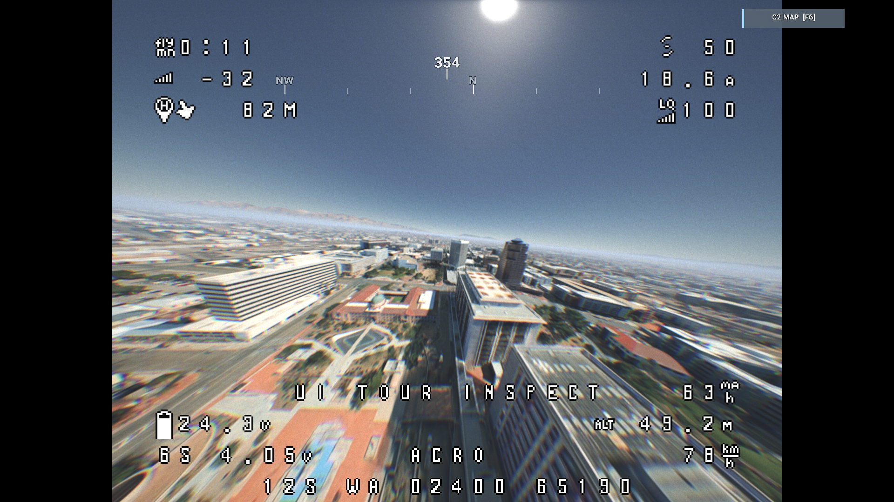

The released aircraft and its own FPV view, flown by the capture pipeline's
virtual pilot. This is an in-engine flight, not a hand-flown acceptance test.

### Time of day and weather

The same public area and stock aircraft under different configured conditions.
These are the game's lighting and weather presets, not a live weather feed.
Open each image for the complete 1920 x 1080 view.

| Clear morning | Clear noon |
| --- | --- |
| [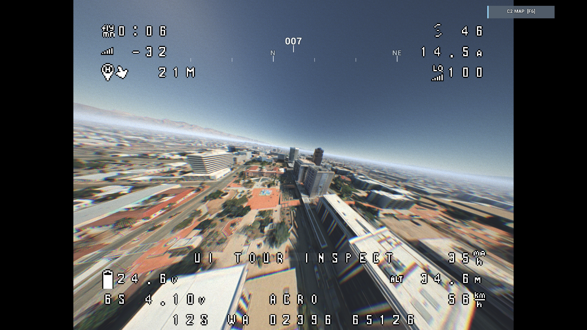](media/v0.42.11/flight-morning.png) | [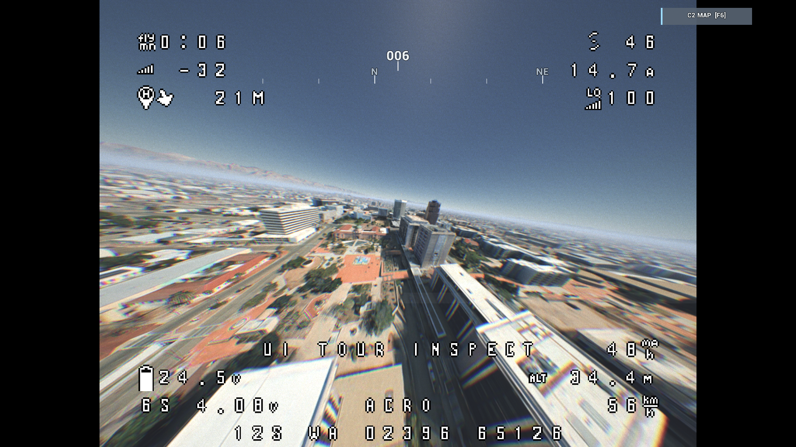](media/v0.42.11/flight-daylight.png) |

| Clear afternoon | Noon rain |
| --- | --- |
| [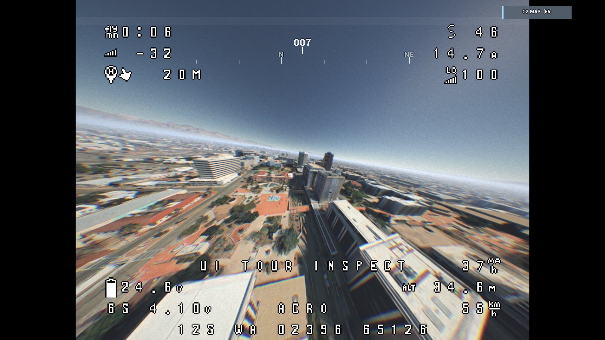](media/v0.42.11/flight-afternoon.png) | [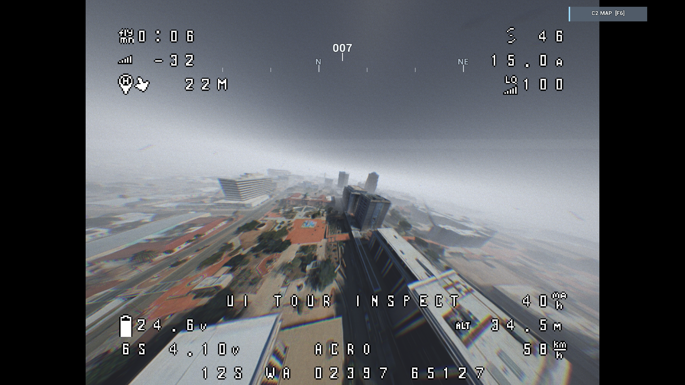](media/v0.42.11/flight-rain.png) |

### Work Bench

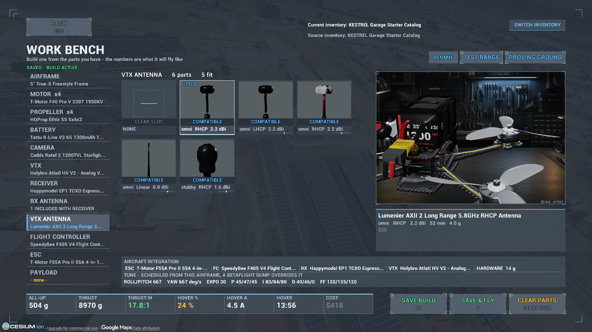

Inspect fitted components, see the aircraft's source inventory and review
predicted weight and performance. This view shows the saved stock build's
antenna-focused close-up; it does not certify real-world component fit.

### Mission Builder

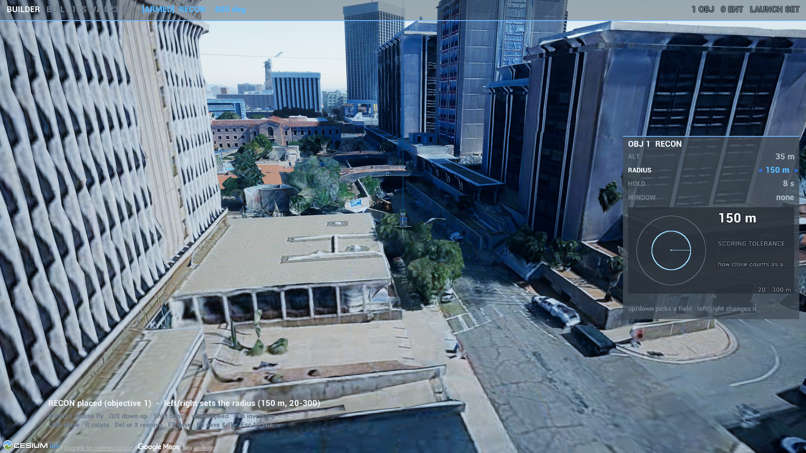

Place a launch point and edit an observation objective in the 3D environment.
The objective settings and surrounding streamed terrain are shown together.

### Strike effects and ISR view

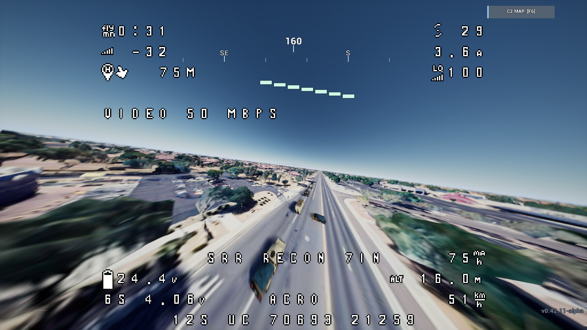

A scripted FPV pass through the stock strike scenario, captured in v0.42.11.

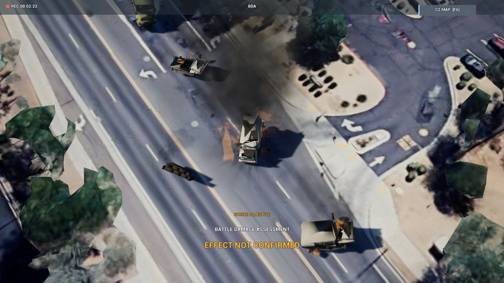

The separate ISR camera shows fire and smoke after the capture's scripted
effect. The game's **Effect not confirmed** verdict is retained: these images
are not proof of physical contact, a completed objective or damage-model validation.

### LAN multiplayer

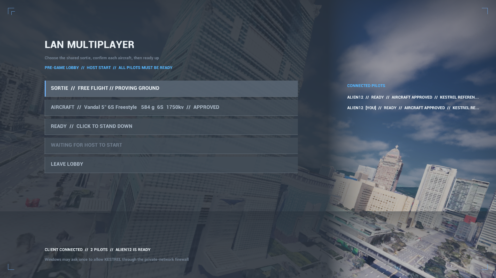

Two real game instances connected on one computer. The roster and aircraft
state are live game UI, not mockups. Physical two-computer acceptance remains open.

### Before launch

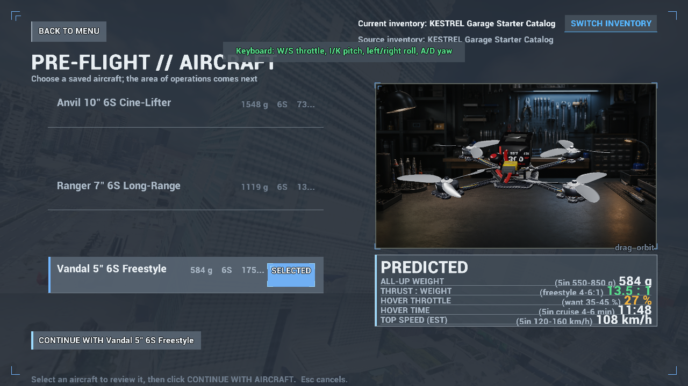

Review the selected aircraft before continuing. Prediction-panel crowding
remains a known issue.

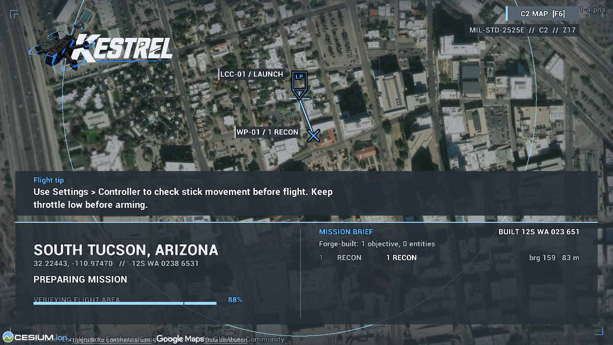

The loading brief shows launch, objective, route and a flight tip. This is not
the in-flight C2 map; its missing-marker regression remains open.

## Known issues and unfinished work

- **Live C2 regression:** launch/objective symbols, labels and the connecting route
  can be absent in flight even when the loading brief displays them.
- Some menu/help text overlaps or clips; battery labels/thumbnails, carbon-fiber
  appearance, straps, wiring and exact part mounting still need visual work.
- LAN passed a streamed two-process test on one PC, but **physical two-PC LAN is
  not yet accepted**. Mission networking, reconnect and host-loss need further tests.
- Full action rebinding, the Work Bench OSD editor and rotating lobby aircraft
  cards are **not included**. Map Controls is only map-action binding.
- Physical radio input, monitor unplug/reconnect, human title-bar dragging and
  actual Alt+Enter/F11 input during live or fully paused flight remain open.
  The full camera/prop matrix and calibrated flight-feel comparisons also remain
  open. No universal parts-fit claim is made.
- Online street-address/POI search and live weather are not included.
- Dusk/night captures expose an overbright horizon and horizontal band; the
  cause remains under investigation. Those captures are not used in this gallery.

The [roadmap](ROADMAP.md) retains the rest of the asset, animation, mission,
UI, replay and acceptance work. This release does not complete that backlog.

## Verification and updates

Exact source: `32401cce14394e7eef324be62738c8b813a65a3f`.
The fresh full build, cook and package completed successfully, with **218 launcher
tests** passing. The display checks above are bounded; they do not prove physical
controller, two-PC or whole-game acceptance. Broader v0.42.11 tour and LAN results
remain historical evidence in [CHANGELOG.md](CHANGELOG.md), not newly repeated tests.

The v0.42.12 ZIP is 676,690,392 bytes. SHA-256:
`5ca8c620c90909f71318a8e5eae5defacf235277ddc15bdaad35abda5895098e`.

Independent review and fresh ZIP extraction verified all **4,451 files**, their
checksums and archive paths. The disposable v0.42.11-to-v0.42.12 HTTPS update check
is recorded separately before default updater promotion. Installed-update success
or interruption recovery is not claimed from unit tests alone.
Back up local settings and aircraft before updating. Offline, corrupt-download,
recovery and broader user-profile preservation acceptance remain tracked.

## Reports, privacy and credits

No live reporting endpoint is bundled. Reports remain local, normally under
`Documents/KESTREL/reports`. Review logs and screenshots before sharing: they may
contain personal paths or locations. [Report issues](https://github.com/nbschultz97/kestrel/issues)
with version, reproduction steps, expected and actual results. Never post tokens.

Customer inventories, missions, datasets and personal profiles are not bundled.
Generic data/catalog tools do not authorize redistribution of customer inputs.

KESTREL is not open source. See the [Evaluation License](LICENSE.txt) and shipped
third-party notices. Unreal Engine, Cesium and imagery, map, font, audio and asset
providers retain their rights and attribution. For licensing contact
[Ceradon Systems](mailto:nbschultz97@gmail.com). Older notes: [RELEASE_NOTES.md](RELEASE_NOTES.md).
