

**Build an aircraft. Choose a location. Practise the flight.**

Windows x64 · Alpha · Proprietary software

[Download v0.44](https://github.com/nbschultz97/kestrel/releases/tag/v0.44.0-alpha.1) · [Features](FEATURES.md) · [Changelog](CHANGELOG.md) · [Roadmap](ROADMAP.md)

KESTREL is an Unreal Engine small-UAS flight simulator with a parts-based Work
Bench, saved aircraft, FPV flight, a mission library and editor, and streamed
real-world terrain. It is for simulation and evaluation, not certified navigation,
engineering validation or real-aircraft flight testing.

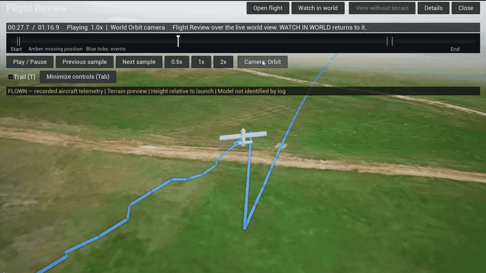

User-recorded Flight Review footage.

## Current release

**KESTREL v0.44 - Flight Review.** Package version: `v0.44.0-alpha`.

Released October 8, 2026. Direct downloads and the automatic updater
now offer v0.44. The isolated v0.42.11-to-v0.44 upgrade passed.

- Open ArduPilot DataFlash BIN recordings directly in **Flight Review**.
- Minimize/expand controls with Tab or the buttons; Escape opens the normal
  pause menu. Toggle the trail with T or its checkbox. Playback controls show
  their current state, and unavailable controls are disabled.
- Review recordings with camera controls and telemetry. The live simulator
  aircraft is hidden during review to prevent a duplicate vehicle.
- Inspect Mission Planner QGC WPL 110 exports in **Data & Catalogs > Flight files**.
  This is read-only inspection, not playable mission import or mission execution.
- Work Bench offers an inventory-mismatch action for saved aircraft whose
  required parts are unavailable. The supported Work Bench OSD layout editor
  and prior controller improvements are retained.

Representative fixed-wing, rover and submersible shapes remain; detailed new
vehicle art and exact-airframe identification are not included. Raw GIS and
point-cloud references do not become rendered customer 3D scenery. Customer
libraries remain local and are excluded from the public download.

This is a normal public alpha release with known defects. Release status does
not imply whole-roadmap completion or production certification.

## Retained v0.42.13 — flight controls

This release adds **Settings > Flight controls** with three editable actions:
**Map**, **Camera tilt up** and **Camera tilt down**.

- Bind a keyboard key or digital gamepad button for each action. Clear a
  binding, restore action defaults, then Save changes or Cancel the draft.
- Camera tilt defaults to Up/Down and moves two degrees per fresh press within
  0–55 degrees. Menu arrows keep working when flight tilt is reassigned.
- Conflicting assignments are rejected. Held/repeated controls and reconnects
  do not create extra camera steps.
- Saved Map assignments migrate to the versioned controller profile. Failed
  saves keep the active controls and editable draft intact.
- Controller calibration reset preserves these action bindings; restoring
  action defaults preserves radio calibration.

Map retains digital USB-radio button support. Camera tilt currently accepts
keyboard keys and gamepad buttons; **USB-radio tilt and axis-switch actions
are not supported**. Arm/disarm, restart, flight mode, camera view/low-light and
the remaining action editor are still pending.

Editor/Game builds, 136 focused source checks, 13 native controller tests and
16 native display regressions passed for the controls source. The fresh package
passed 218 launcher tests and all 4,451 archive-file checks. Its default panel
was reviewed from a fresh extraction at 720p and 1080p; physical-device and full
interaction acceptance remain separate.

[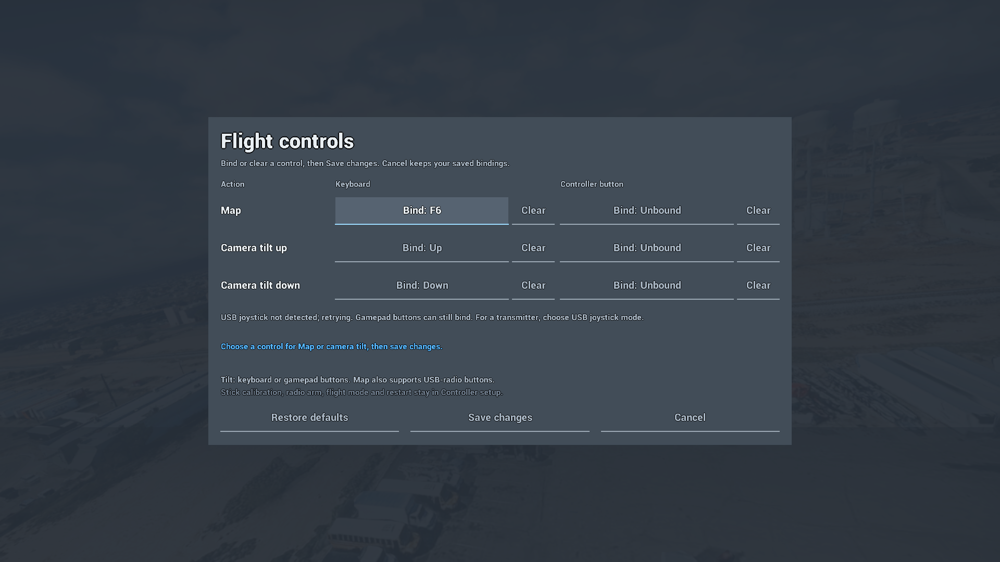](media/v0.42.13/flight-controls.png)

Actual v0.42.13 packaged capture, unchanged. [Capture provenance](media/v0.42.13/README.md).

## Retained v0.42.12 — display reliability

Display selection and window behavior can now be configured independently.

- Choose **Display** separately from **Window mode**. Auto selects the
  highest-resolution attached panel; a manual choice remembers the monitor.
- Switch between Windowed, Fullscreen and Borderless on the selected screen.
  Windowed sizes fit its usable desktop area, with a native title bar and
  mixed-DPI placement handling.
- Settings changes offer **Keep changes** and **Revert**, with a 15-second
  real-time rollback. Unconfirmed changes do not replace the startup preference.
- Alt+Enter and F11 use the same monitor and sizing logic. On the Settings page
  they request confirmation; outside Settings they keep immediate toggle behavior.

Rendered development and packaged checks passed display transitions, confirmation
and saved-monitor restart on two mixed-DPI screens. The final package also passed
its rendered window-transition, confirmation and saved-monitor restart checks. These are not human drag,
monitor hotplug, physical-radio or live/fully paused-flight shortcut acceptance.

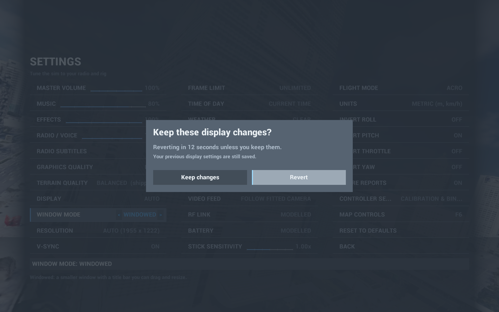

Actual Settings capture from the packaged v0.42.12 build, showing separate Display
and Window mode controls with the Keep changes/Revert confirmation. Not a mockup.

## Start here

1. [Download KESTREL-alpha-win64.zip](https://github.com/nbschultz97/kestrel/releases/download/v0.42.13-alpha.1/KESTREL-alpha-win64.zip).
2. Check its SHA-256 against the release page or attached checksum. Extract into
   a new folder; do not mix versions or run from inside the ZIP.
3. Start **KESTREL.exe**, the player-facing launcher. Keep the entire extracted
   tree beside it; the nested game executable is not the normal entry point.
4. Check controller calibration, input source and axis directions, then save.
   Compatibility with every USB radio has not been established.
5. Choose Free Flight or the Test Range, select a saved aircraft and review the
   displayed controls before arming.

Windows signing note: this package is not publisher-signed. Windows or organization
policy may warn or block it; use only where permitted and do not disable protections.

The intended public Cesium configuration is included. Streamed terrain needs
Internet access, service availability and loading time. The offline Test Range
is not a cached copy of the globe; there is no offline worldwide street map.

Windows x64 is supported. Plan for a modern discrete GPU, adequate memory and
space for game extraction, update staging and terrain caches. Exact minimum/
recommended hardware performance is not certified. The ZIP is not a Windows
runtime installer; retain the exact error if launch fails.

## Retained v0.42.11 capabilities

- **Data & Catalogs:** create, import, export, copy, rename, switch and edit custom
  catalogs using validated JSON. The base catalog stays read-only.
- **Work Bench:** current/source inventory labels, Switch Inventory, saved-build
  identity checks, click-only aircraft selection and selected-aircraft predictions.
- **Navigation:** city/coordinate search previews a movable pin before launch;
  major-city labels, a coarse offline overview, Free Flight C2, place labels
  and a compass aid orientation.
- **Local data:** named collections, placed image overlays and a Cesium connection
  check. Raw GIS/point clouds still need conversion.
- **Aircraft:** stock starters, targeted ten-inch prop compatibility, frame-grounded
  support metadata, stack spacers and selected receiver/video-board supports.
- **Reliability:** controller failed-save preservation, clearer Settings values,
  targeted thumbnail residency, per-aircraft audio teardown, terrain request
  handling and Cesium world/component lifecycle fixes.
- **Distribution:** public notices and font licenses, bundled public terrain
  configuration, HTTPS-only updater redirects and bounded request timing.

Existing flight, Work Bench, named builds, missions/editor, ranges, records,
modeled weather and wind remain. See [FEATURES.md](FEATURES.md) for boundaries.
Configured weather is not a live weather service.

## Gallery from v0.42.11

Actual captures from the v0.42.11 release, using stock aircraft and public terrain.
These are not concept renders or previews of unfinished features. Open an image
for its full-resolution view; existing UI and model limitations remain visible.
The gameplay images below are unchanged v0.42.11 captures. The new v0.42.13
controls screenshot appears in the release section above.

### FPV flight

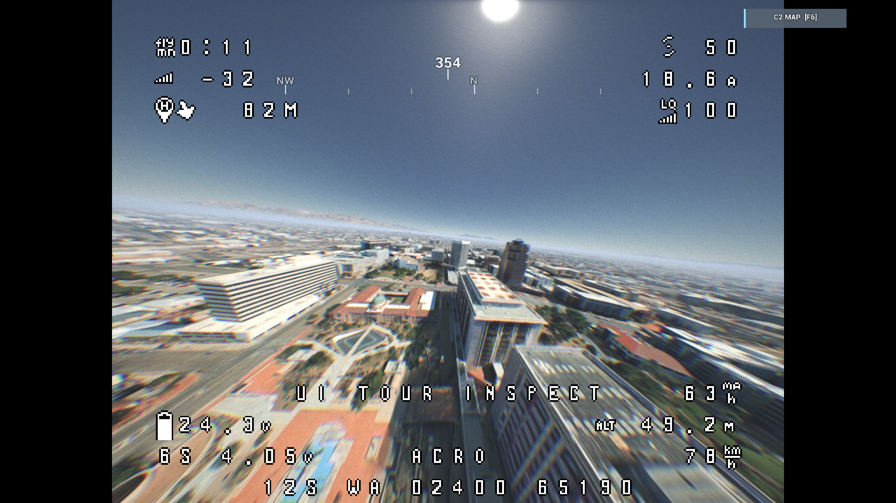

The released aircraft and its own FPV view, flown by the capture pipeline's
virtual pilot. This is an in-engine flight, not a hand-flown acceptance test.

### Time of day and weather

The same public area and stock aircraft under different configured conditions.
These are the game's lighting and weather presets, not a live weather feed.
Open each image for the complete 1920 x 1080 view.

| Clear morning | Clear noon |
| --- | --- |
| [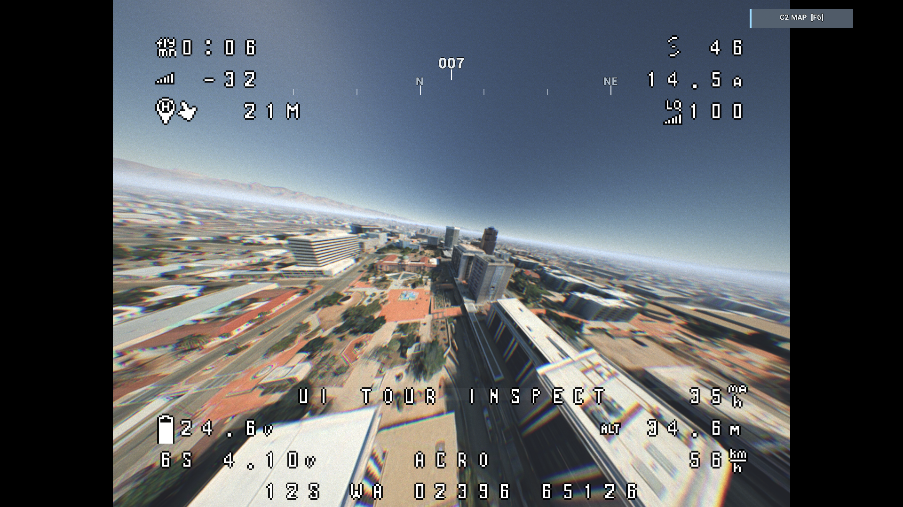](media/v0.42.11/flight-morning.png) | [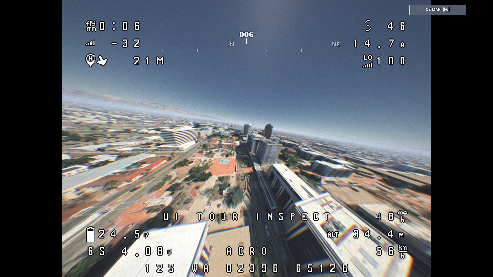](media/v0.42.11/flight-daylight.png) |

| Clear afternoon | Noon rain |
| --- | --- |
| [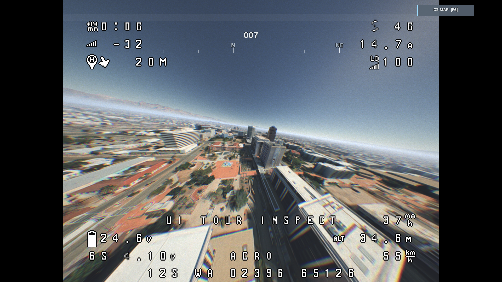](media/v0.42.11/flight-afternoon.png) | [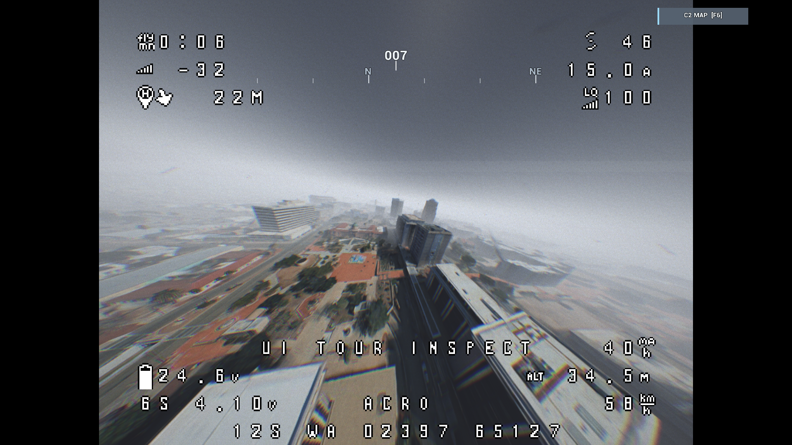](media/v0.42.11/flight-rain.png) |

### Work Bench

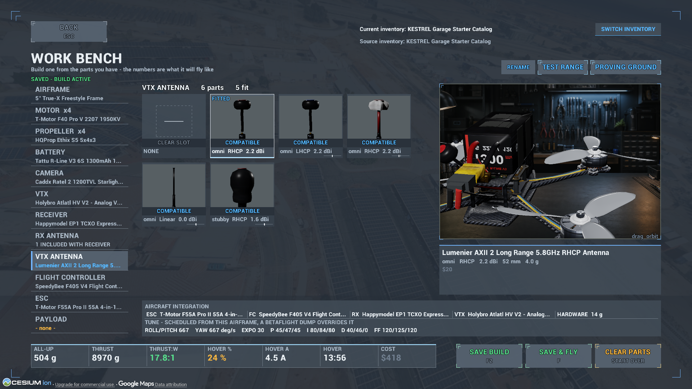

Inspect fitted components, see the aircraft's source inventory and review
predicted weight and performance. This view shows the saved stock build's
antenna-focused close-up; it does not certify real-world component fit.

### Mission Builder

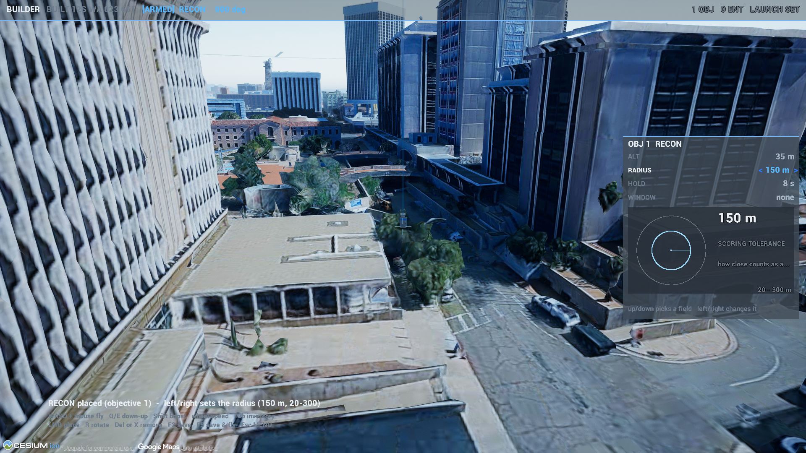

Place a launch point and edit an observation objective in the 3D environment.
The objective settings and surrounding streamed terrain are shown together.

### Strike effects and ISR view

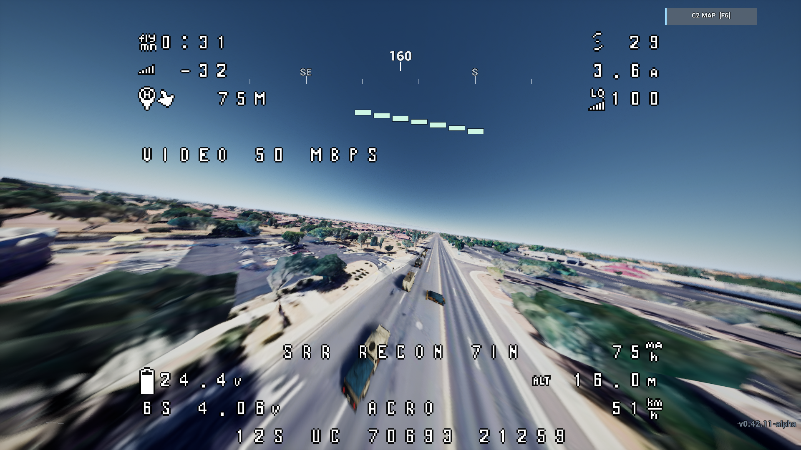

A scripted FPV pass through the stock strike scenario, captured in v0.42.11.

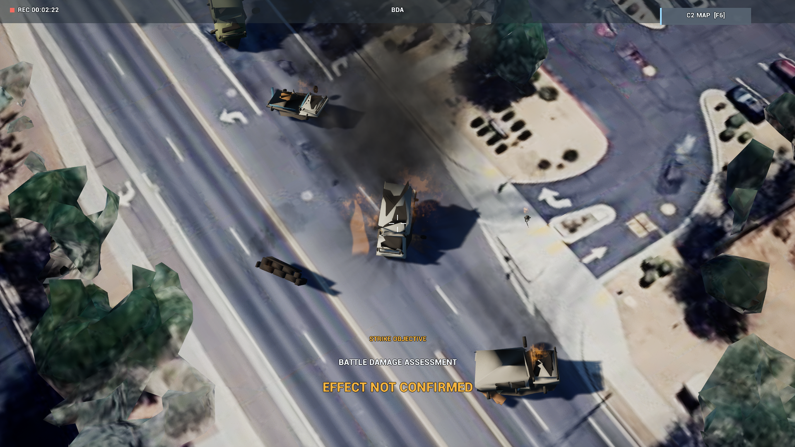

The separate ISR camera shows fire and smoke after the capture's scripted
effect. The game's **Effect not confirmed** verdict is retained: these images
are not proof of physical contact, a completed objective or damage-model validation.

### LAN multiplayer

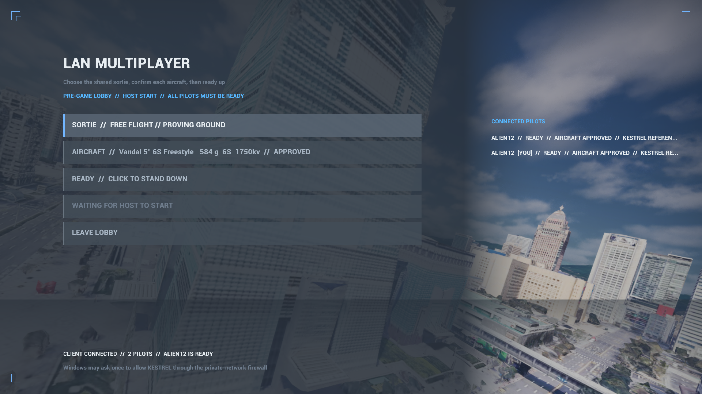

Two real game instances connected on one computer. The roster and aircraft
state are live game UI, not mockups. Physical two-computer acceptance remains open.

### Before launch

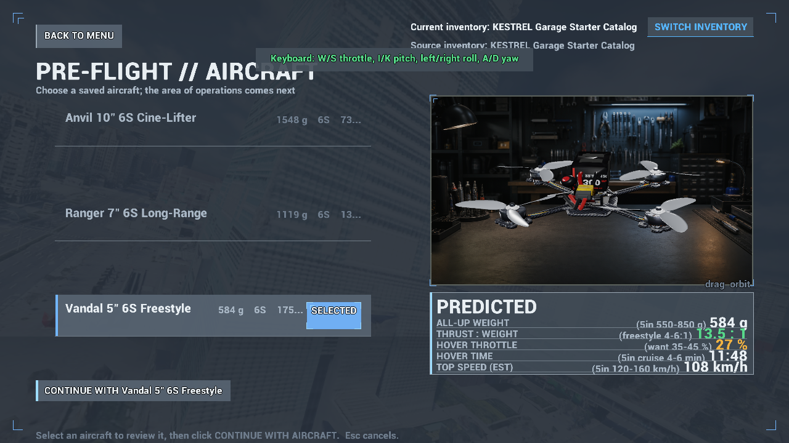

Review the selected aircraft before continuing. Prediction-panel crowding
remains a known issue.

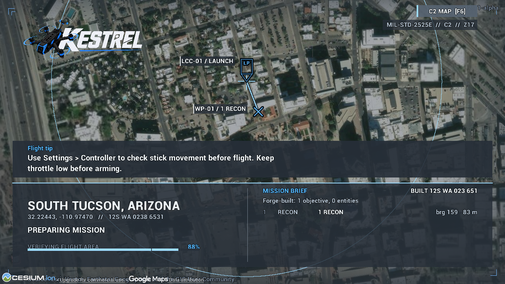

The loading brief shows launch, objective, route and a flight tip. This is not
the in-flight C2 map; its missing-marker regression remains open.

## Known issues and unfinished work

- **Live C2 regression:** launch/objective symbols, labels and the connecting route
  can be absent in flight even when the loading brief displays them.
- Some menu/help text overlaps or clips; battery labels/thumbnails, carbon-fiber
  appearance, straps, wiring and exact part mounting still need visual work.
- LAN passed a streamed two-process test on one PC, but **physical two-PC LAN is
  not yet accepted**. Mission networking, reconnect and host-loss need further tests.
- Full action rebinding and rotating lobby aircraft cards remain unfinished.
  The Work Bench OSD editor supports a bounded set of simulator readouts; it
  does not provide complete Betaflight Configurator parity.
- Physical radio input, monitor unplug/reconnect, human title-bar dragging and
  actual Alt+Enter/F11 input during live or fully paused flight remain open.
  The full camera/prop matrix and calibrated flight-feel comparisons also remain
  open. No universal parts-fit claim is made.
- Online street-address/POI search and live weather are not included.
- Dusk/night captures expose an overbright horizon and horizontal band; the
  cause remains under investigation. Those captures are not used in this gallery.

The [roadmap](ROADMAP.md) retains the rest of the asset, animation, mission,
UI, replay and acceptance work. This release does not complete that backlog.

## Verification and updates

Source: `5444e5238f5e884a37adc4e64df150206cd6f643`.
The ZIP is 679,194,737 bytes. SHA-256:
`495d62f4f2039a40a7341f483965e7048375f9bce419b8070885c3d41611b69e`.

All 4,453 archive files and CRCs were verified. Eight packaged replay/import
tests passed with no failures. Source and cooked-content inventories were reviewed,
and known private-file hashes were checked. The application ZIP excludes customer
logs, replay files, datasets and local catalogs; the featured GIF is separately
authorized demonstration footage. An isolated v0.42.11 install downloaded the
public HTTPS archive, verified its checksum and upgraded to v0.44. Synthetic Saved
and profile fixtures survived. A cold root-launcher start passed the rendered
review-menu test; a subsequent check reported up to date without reinstalling.
Earlier version-specific tests and screenshots remain historical evidence.

The Windows package is not publisher-signed. Keep Windows protections enabled
and follow your organization's software policy. Release checksums identify the
published archive; they are not a publisher signature.

The upgrade check encountered transient HTTPS manifest timeouts; the installed
game still started, and the next check succeeded. An initial null-renderer UI
test failed; the corrected rendered test passed. This bounded check does not
establish full profile preservation or interruption recovery. Back up local
settings and aircraft before updating.

## Reports, privacy and credits

No live reporting endpoint is bundled. Reports remain local, normally under
`Documents/KESTREL/reports`. Review logs and screenshots before sharing: they may
contain personal paths or locations. [Report issues](https://github.com/nbschultz97/kestrel/issues)
with version, reproduction steps, expected and actual results. Never post tokens.

Customer inventories, missions, datasets and personal profiles are not bundled.
Generic data/catalog tools do not authorize redistribution of customer inputs.

KESTREL is not open source. See the [Evaluation License](LICENSE.txt) and shipped
third-party notices. Unreal Engine, Cesium and imagery, map, font, audio and asset
providers retain their rights and attribution. For licensing contact
[Ceradon Systems](mailto:nbschultz97@gmail.com). Older notes: [RELEASE_NOTES.md](RELEASE_NOTES.md).
