# KESTREL v0.33.0-alpha — the current public release

Published August 24, 2026. v0.33 adds the first tactical C2 layer to mission
loading and rebuilds the WORK BENCH presentation around a darker, more legible
armorer-style studio. Existing installations receive it through the
auto-updater on their next `KESTREL.exe` launch.

### Tactical mission loading

- The loading map now shows the selected and alternate LCC launch points, the
  ordered route, numbered waypoints, strike objectives, and designated targets.
- Friendly points, route points, and hostile targets use distinct frame shapes
  as well as colour, and every symbol follows the map's animated scale and
  anchor.
- Mission information now sits on a high-contrast command tray with stronger
  heading, label, and range typography.

### WORK BENCH and aircraft assembly

- **A new aircraft starts empty.** Airframe, motors, props, battery, and camera
  no longer inherit the shelf preview. Returning from a test flight still
  preserves the build being tuned.
- Manual exposure, a 32-degree product lens, a deliberate key/fill/rim rig, and
  a neutral field replace the washed-out carbon and blue engine checker.
- Batteries on four-inch-and-larger frames sit on the top plate; cameras clear
  the carbon; VTX boards move behind the FC/ESC stack; and aerial bases seat on
  a rear mount instead of floating over the frame.
- Predicted-performance panels and the WORK BENCH stat bar now have complete
  borders, row rules, and readable reference-band text.

### Loading-state fix

- Centerless worlds such as TEST RANGE clear the previous mission name before
  reading their own title, so a prior label such as COLUMN HALT cannot leak
  onto the next loading screen.

### Package and verification notes

- The public archive does not embed a Cesium access token or raw Discord
  webhook. Existing installs retain their local `cesium_token.txt`; first-time
  installs can provide one at `Documents\KESTREL\cesium_token.txt`. Crash
  reports still use the protected HTTPS relay included in the package.
- All 853 Python tests and 209 subtests passed, the UE 5.8 Development game and
  editor targets compiled, all 94 launcher/update tests passed, the archive
  verified, and the packaged executable completed a headless smoke launch.
- Every catalog row resolves to a mesh. VTX, antenna, and stack are still
  read-only auto-fitted categories; selectable electronics remain a separate
  schema/persistence/UI wave.
- This public package is traceable to Ceradon Sim source commit
  `f440537c7152b5200898be881ced771d37711b9e`; the same commit is embedded in
  `source-commit.txt` and published in `kestrel-update.json`.

---

# KESTREL v0.32.0-alpha (historical)

Published August 24, 2026. v0.32 combines the rendered-flight rework, missions
that fly exactly what they author, and a bench that finally explains what a
build will feel like. Existing installations receive it through the
auto-updater on their next `KESTREL.exe` launch.

### Mission-authoritative flight

- **The authored objective list is now the flown route.** Each objective becomes
  a leg of intent; moving a waypoint in mission JSON changes the route without a
  separate hard-coded filming path.
- **Per-leg `agl_m` follows the ground**, not the launch plane, and authored
  `speed_mps` remains the commanded speed while clearance control works
  independently over rising terrain.
- **Below-datum objectives are explicit and supported.** `"below_datum": true`
  opts a leg into negative launch-plane altitude; all five `cw-*` training
  missions mark exactly their valley objectives this way.
- **Live link behavior is available for authored runs.** `-CeradonFlyRfLive`
  uses real RF conditions instead of the scripted 94 percent filming overlay.

### Flight model and rendered pilot

- **The pilot holds attitude, not airspeed.** Pitch now behaves like an ACRO
  pilot: pulse to a lean, center, and hold, with airframe feed-forward, slow
  trim learning, and climb-out anti-windup. In disturbed air, pitch movement is
  3.7–4.8 times lower and peak-to-peak nose motion drops from 15° to 4° while
  calm-air performance and authored speed remain intact.
- **Turns use coordinated bank on the flight path.** The previous roll relay
  saturated at small course errors and swung roughly 95° of horizon. The new
  coordinated-turn relation reduces ring-flight bank standard deviation from
  29° to 1.15° and improves disturbed-air cross-track performance.
- **Authored speed and altitude protection are separate signals.** Legs authored
  at 12, 15, and 22 m/s no longer collapse to about 11.7 m/s; a 15 m/s leg now
  makes 15.03 m/s over the same rising terrain while keeping clearance.
- The yaw sideslip deadband widens from 1.2 to 2.0 m/s so gusty forward flight
  does not hold unnecessary rudder on roughly a third of frames.

### HANGAR and WORK BENCH

- **HOVER THROTTLE is predicted and banded.** The seventh bench stat reports the
  expected percentage and labels the 35–45 percent range Nominal, with Caution
  outside it. A floater or brick remains a design choice; the result is visible
  before launch.
- **Every predicted stat has an airframe-specific reference band.** All-up
  weight, thrust-to-weight, hover time, and top speed use the fitted prop class
  (whoop, 5-inch freestyle, 7-inch long range, or lifter) and deliberately say
  Normal rather than Good.

### Verification notes

- The C++ automation suite expanded to 161 tests and runs in CI, including the
  airframe-consistency suite and steady-cruise / bank-through-turn benches.
- Headless verification cannot judge Cesium collision, tonemapping, the v0.31
  prop-wash collar, or rotor pip; those remain visual-session checks.
- This public package is traceable to Ceradon Sim source commit
  `b50242464501444c0d268eeef953f143400decfe`; the same commit is embedded in
  `source-commit.txt` inside the archive and in `kestrel-update.json`.

---

# KESTREL v0.31.0-alpha (historical)

v0.29.2, v0.30.0 and v0.31.0 shipped to testers through the auto-updater. This
historical section summarizes those three waves. The headline of v0.30 is
visual — the aircraft you build finally looks like the parts you picked — while
v0.29.2 and v0.31.0 carried the flight-model honesty work underneath it.

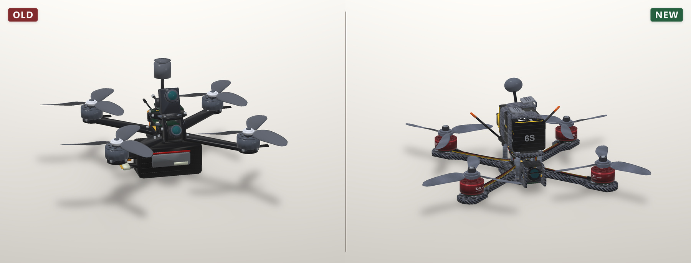

### Flight model

- **A 10-inch is not a heavy 5-inch.** One factory tune went to every aircraft
  in the sim; rates and feed-forward are now scheduled off airframe authority
  (667/422/299 deg/s; F = 120/65/41), and the WORK BENCH prints what a build
  got.
- **Three rendered-flight fixes were recovered before release.** The virtual
  pilot's yaw hunt, the avoidance probe's chatter on the other axis, and the
  altitude-floor press clamping the forward stick were all removed.
- **Impact you can read** — thresholds moved so a belly-slide, a real auger-in,
  and a catastrophic slam are three different outcomes instead of two silent
  ones.

### Aircraft & parts

- **169 part meshes, up from 99, and all of them textured.** Carbon weave
  oriented per part, silkscreen and components on the PCBs, anodised motor
  bells, printed battery wraps. No untextured placeholder geometry remains in
  the build catalogue.
- **Airframes calibrated against manufacturer CAD.** The TBS Source family was
  measured out of the vendor's own STEP files — plate outline, arm taper, stack
  mounting, standoff heights — and the rest of the airframe classes were scaled
  to sit correctly against them.
- **Propellers rebuilt from measurement.** Real prop geometry plus 84 product
  photos, resolved into ten planform families. Pitch and blade count are visual
  axes now, and the blades are translucent polycarbonate rather than opaque
  slabs.
- **Li-ion packs are cylinder banks, LiPo packs are bricks.** They were the same
  mesh with a different label; they are now different objects with different
  silhouettes and wraps.
- **Full antenna, VTX, camera, GPS and receiver families**, each with the
  pigtails and connectors the real part carries.
- **Showcase builds are wired end to end** — camera looms, VTX coax, receiver
  antenna tubes, and XT60s that mate to their counterpart instead of floating
  beside it.

### In flight

- **Props are visible in the FPV view.** The camera near clip was culling the
  blades out of frame; it now sits inside the disc, which restores the sweep
  across the top and bottom of the picture that defines the FPV look.
- **The fitted camera drives the flight FOV.** Choosing a narrow analog cam and
  a wide digital cam changes what you see out the front, not just the part list.
- **Prop-wash dust on takeoff** — a ring and puffs lifted off the pad, scaled by
  thrust over hover; visible from the pilot's seat in v0.31, with faint rotor
  arcs on the lens at steep nose-down.
- **Kills swap in a wrecked airframe** rather than deleting the aircraft.
- **The HANGAR spools the props** while you build.

### World & characters

- **New pilot and twelve mission characters**, rebuilt on a corrected skeleton —
  the old rig had joint orientations that broke every pose it was given. v0.31
  shipped all thirteen fully textured.
- **The range remembers which venue it is** — flying again right after bench
  work brings up the range you asked for, not the one you were last in.
- **The vehicle fleet rebuilt** — twenty military vehicles with real role
  silhouettes and wheels/doors as separate parts, plus the first civilian
  traffic set (sedan, hatchback, van, pickup) for the road network. Wrecks
  regenerated to match.
- **Twelve mission-objective set pieces and the support props re-authored** —
  sandbagged bunker, camo-net command post, radar, fuel depot, helipad, and
  the rest, each readable from recon altitude.

### Under the hood

- Part meshes re-authored and re-exported through a single generator, so the
  catalogue, the HANGAR preview, and the flight mesh all read the same source.
- Materials consolidated onto shared textured masters (weave, silkscreen,
  anodise, wrap) instead of per-part flat colours.
- Reference measurement set — vendor STEP files, prop geometry, and product
  photography — captured alongside the generator so parts can be re-derived
  rather than re-eyeballed.

### Preview gallery

| | |
|---|---|
| 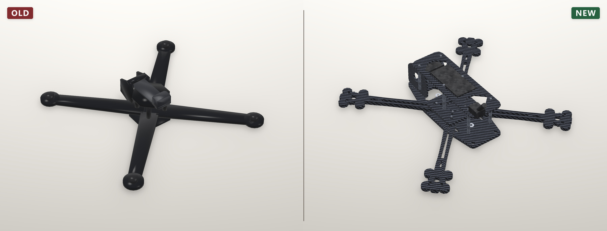 | 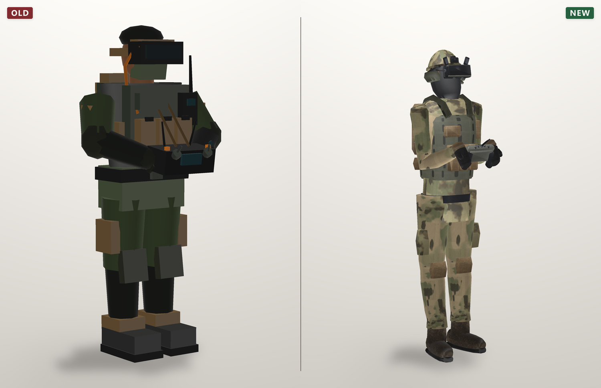 |
| Airframes measured out of vendor STEP files. | The pilot, rebuilt on the corrected skeleton. |

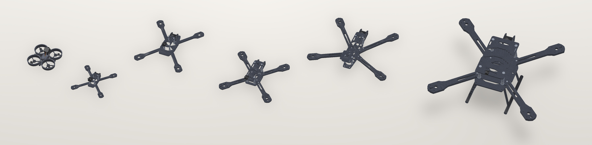

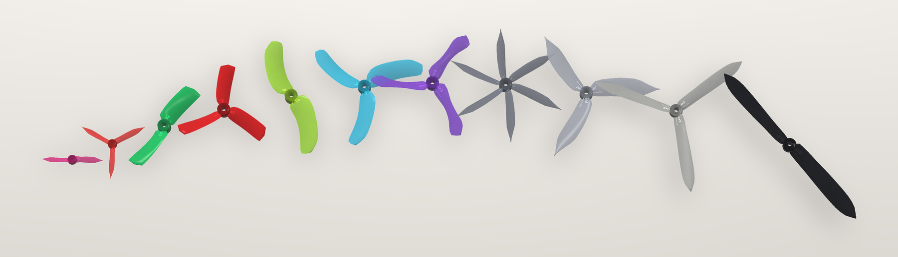

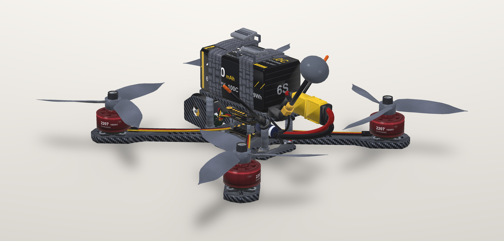

| | |
|---|---|
| 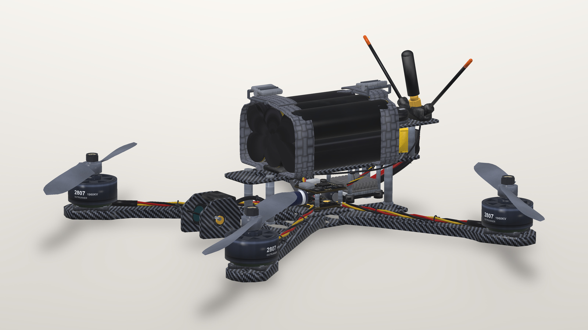 | 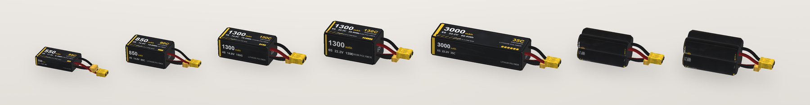 |
| A 7-inch long-range build on a Li-ion cylinder pack. | The pack family, 550 mAh through 6S Li-ion. |

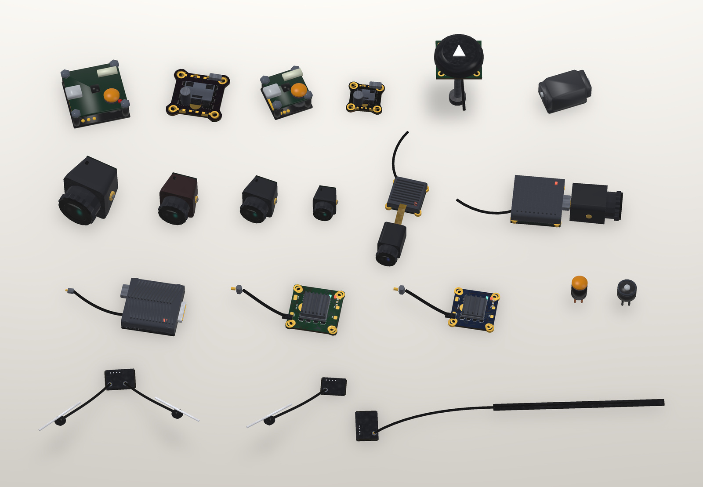

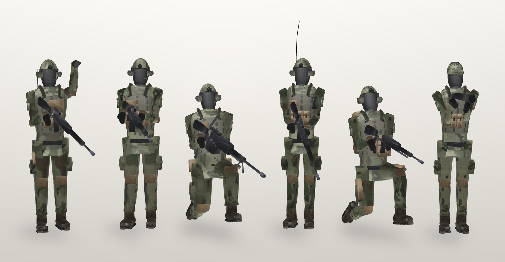

| | |
|---|---|
| 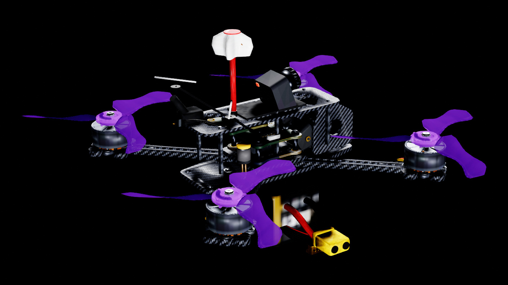 | 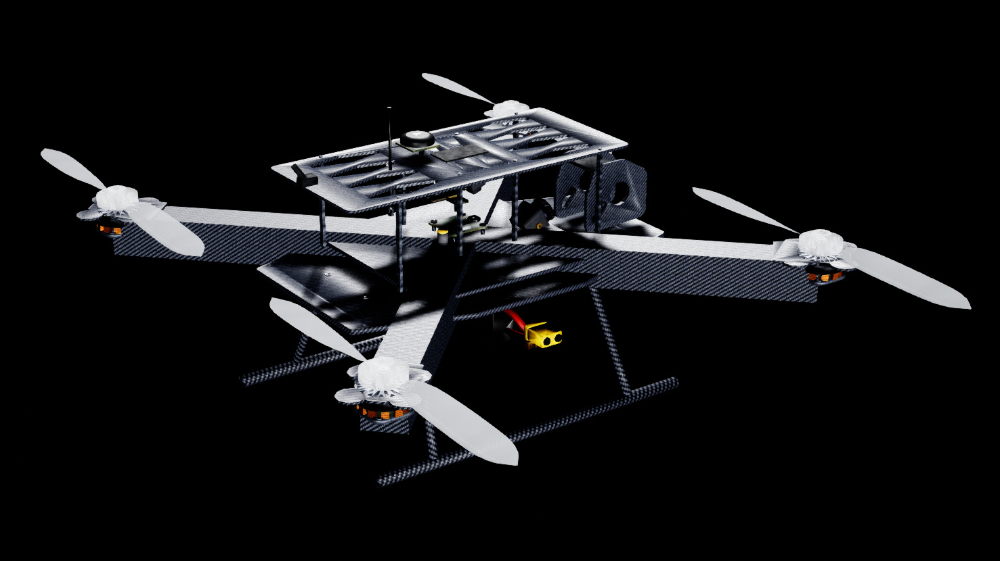 |
| 5-inch freestyle, captured in engine. | 13-inch heavy-lift, captured in engine. |

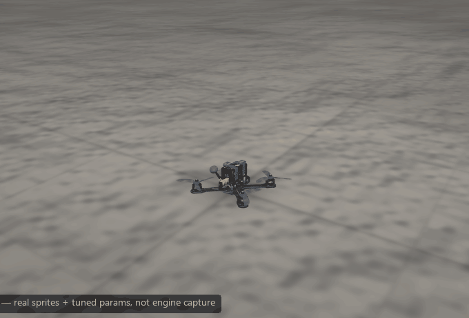

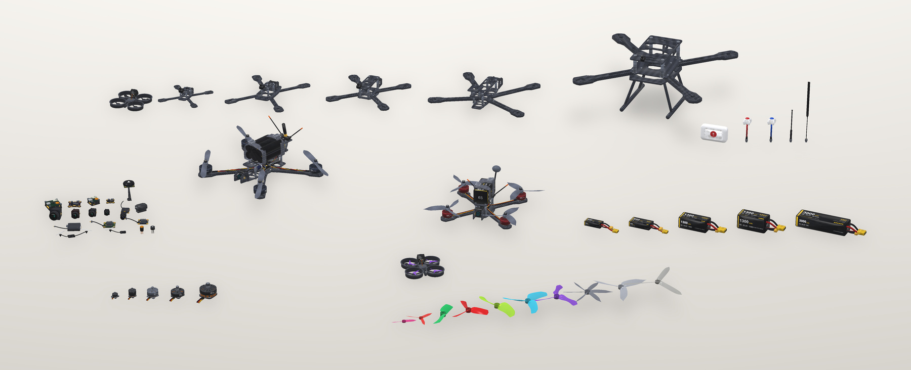

---

# KESTREL v0.29.1-alpha (historical)

The release before the current one — the strike line, the analog FPV feed, the
test range, and the nineteen-item play-test wave. Kept for reference; the
full per-build history is in `CHANGELOG.md` inside the zip.

## What shipped in it

- **The strike is a one-way attack, and the pilot now flies it like one.** On the
  terminal leg the avoidance response and the AGL speed brake come off: the thing
  filling the look-ahead IS the aim point, so every avoidance reaction was a miss,
  and the brake's premise — *"this aircraft has to still be flying in two seconds"*
  — is false for a munition. Left in, the dive sat inside the floor band for its
  whole length and bled back the forward stick producing it, so the aircraft
  settled into a controlled descent and arrived at walking pace. Impact speed
  is now logged.
- **Analog FPV feed** — a 4:3 window with deterministic noise, framed last over
  everything, because an element that lands in the pillarbox was never
  transmitted on a real analog link.
- **Convoy placement that survives contact with the map** — the column was in
  the median because its heading came from OSM, and the warhead fired on a
  radius instead of on the hull.
- **A play-test wave** — nineteen reports from v0.28.3 (black inventory tiles,
  spawning underground, the 10–20 s launch freeze, black bars in fullscreen,
  the minus key eating the MGRS northing, the weather clamp, etc.). See the
  changelog for the long form.
- **Test range with user-set wind / weather / atmosphere** — controls live in
  the flight view, sliders drive the same atmosphere the physics reads.
- **New markers** (waypoints, spawn, strike) replacing the old black platforms.
- **WORK BENCH renamed to HANGAR** and reorganized.
- **Flight controller on its own 1 kHz clock** instead of the render clock, with
  per-airframe rate scaling.

## Install or update

Existing installations update automatically the next time `KESTREL.exe` is
launched. For a new installation, download `KESTREL-alpha-win64.zip`, extract it
to its own folder, and run `KESTREL.exe`.

The archive is Windows x64 and requires a discrete GPU for practical UE5
performance. This remains an alpha release; report crashes or unexpected
behavior through the repository issues page.

## Trailer and clips

- [Full trailer (v9, 92 s, 1080p)](https://github.com/nbschultz97/kestrel/releases/download/v0.29.1-alpha/kestrel-trailer-v9.mp4)
- [LinkedIn 35 s cut](https://github.com/nbschultz97/kestrel/releases/download/v0.29.1-alpha/kestrel-short-linkedin.mp4)
- [Vertical 60 s cut (IG / TikTok)](https://github.com/nbschultz97/kestrel/releases/download/v0.29.1-alpha/kestrel-short-vertical.mp4)
