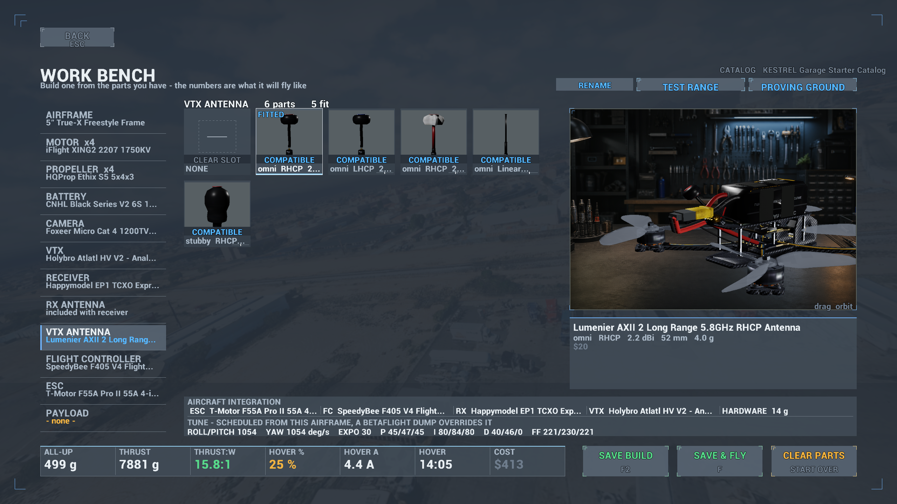
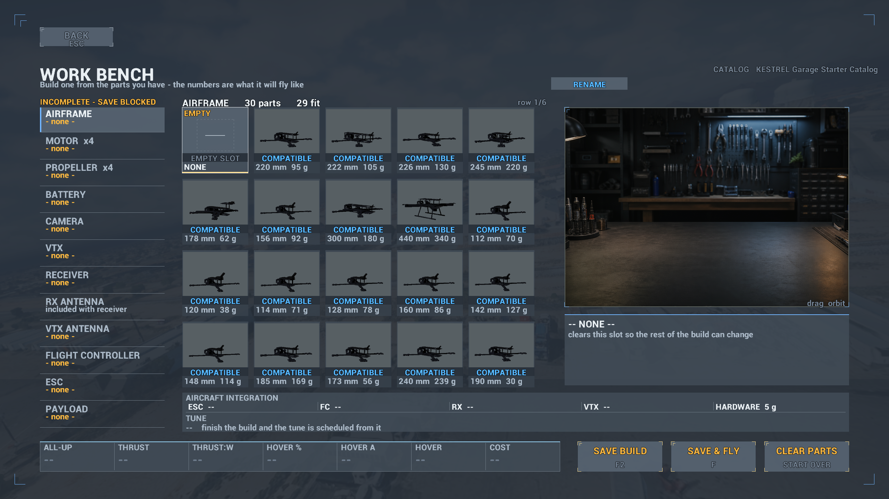
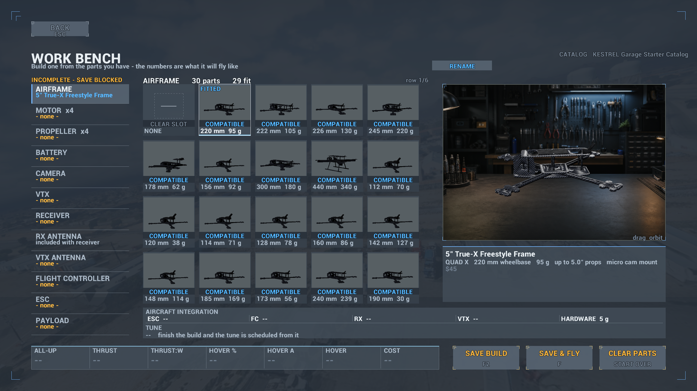
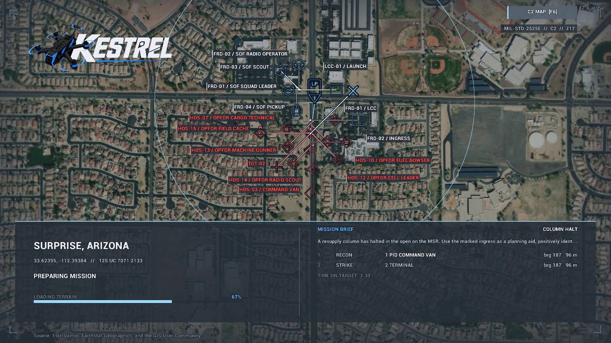

# KESTREL v0.42.3-alpha-unsigned.1 — unsigned evaluation prerelease

Prepared August 31, 2026 from the verified v0.42.3-alpha candidate. This is an
explicitly **unsigned** evaluation artifact, not the current public release.
It is not advertised through `kestrel-update.json`, is not the GitHub “Latest”
release, and will not be offered to installed KESTREL launchers. The supported
download and updater channel remain on v0.40.1-alpha.

The official KESTREL repository, Rotopter, and MilGit carry this same unsigned
evaluation prerelease. Their release assets have the identical filename, byte
length, and SHA-256 recorded below, and their `main` branches have identical Git
trees. This is mirror publication of an evaluation build, not promotion into
the automatic-update channel.

Use this package only in an approved test environment. Both release-owned
executables report `NotSigned`: `KESTREL.exe` and
`CeradonSim/Binaries/Win64/CeradonSim.exe`. Windows SmartScreen, Smart App
Control, or organization policy may warn or block the package. Do not disable
or weaken endpoint protections to run it; use the signed release when policy
requires a trusted publisher.

### Artifact identity

- Release tag: `v0.42.3-alpha-unsigned.1`
- Archive: `KESTREL-alpha-win64.zip`
- Source repository: `https://github.com/nbschultz97/ceradon-sim`
- Source commit: `bac24999010eb99f5117cf7591643f15e1bc87ec`
- Source version stamped in the archive: `v0.42.3-alpha`
- Archive size: `673,203,991` bytes
- SHA-256: `c3fea9c8ae330908302060e026db318b173a9d20fe422d8f09f3c9498cb38cbf`

The `.1` suffix distinguishes this unsigned distribution record from the
canonical `v0.42.3-alpha` tag, which remains available for a future signed
release. Publishing this prerelease must not change `kestrel-update.json` or
the repository’s GitHub “Latest” release.

### Added

- A local-only `FPV / LINE OF SIGHT` camera is available from `V` or the
  clickable pause-menu action. It stays at the launch operator’s eye and tracks
  the local aircraft without changing replicated flight physics.
- The catalog adds a graph-valid 2.5-inch 16x16 micro frame, with compatibility
  coverage proving at least one complete build for every shipped frame, motor,
  propeller, battery, FC, and ESC.

### Fixed

- Controller calibration remains interactive when opened from paused Settings,
  including mouse, keyboard, and gamepad navigation, clean cancellation, and
  refusal to persist invalid or no-device completion.
- Prop rendering uses mutually exclusive sharp, transitional-blur, and fast-
  halo phases with hysteresis while retaining the selected prop color.
- Free Flight displays the AO’s resolved local solar time; the generic selector
  now says `CURRENT TIME`.
- BLITZ E80 FC/ESC compatibility uses its 30.5x30.5 mounting pattern, and
  integrated ESC current limits participate in compatibility checks.
- Release automation now refuses `-Publish -NoManifestPush`, publishes the
  updater manifest before tagging, and verifies that the canonical release tag
  resolves to the exact official-main manifest commit. This unsigned prerelease
  is intentionally published manually outside that signed canonical path.

### Verification and limitations

- Full Python/source-contract suite: 1,242 passed plus 243 subtests.
- Unreal Editor target built successfully.
- Full `CeradonSim.KESTREL` automation: 203 tests, 0 failures.
- Catalog coverage includes all 29 frames, 34 motors, 33 propellers,
  22 batteries, 10 FCs, 12 ESCs, and all 8 payloads.
- Archive verification confirmed the expected launcher, game payload, source
  and version stamps, runtime content, public Cesium token, and absence of a
  Discord webhook. The digest and byte length above identify the exact ZIP.
- Production Authenticode signing, clean-machine publisher verification, and
  promotion to the signed automatic-update channel remain incomplete.
- LOS terrain/structure occlusion, lost-visual feedback, controller binding,
  packaged single-player/two-PC acceptance, full multiplayer mission
  replication, and automatic host migration remain open.

---

# KESTREL v0.40.1-alpha - the current public release

Published August 26, 2026. v0.40.1 stabilizes the v0.40 aircraft-art,
mission-authoring, and startup wave. Existing installations receive it through
the updater on their next `KESTREL.exe` launch.

### Work Bench crash fixed

- The v0.40 crash minidump resolved to immediate thumbnail capture forcing
  render-state updates from inside `PlayerTick` while imported parts settled.
  Tile and live-preview captures now run in Unreal's deferred end-of-frame pass.
- The crash reporter writes one diagnostic per process crash rather than two
  copies while Unreal unwinds.
- A fresh packaged 11-screen Work Bench tour exercised empty-build startup,
  representative assemblies, Stack thumbnails, and all 22 battery products:
  exit 0, no crash bundle, and no new crash report.

### Cleaner identity and interface

- The crest/reticle and bright sports-blue treatment are replaced by a flat,
  angular three-plane flight-datum mark, restrained cyan accent, and a clean
  KESTREL wordmark across the game, native splash, executable, and release page.
- Main-menu rows now read `FREE FLIGHT`, `MISSIONS`, `WORK BENCH`, and `RECORDS`
  without parenthetical instructions or dynamic counts.
- Saved-build row actions say `EDIT` and `RENAME` instead of unexplained `E` and
  `R` keycaps. Test Range and Proving Ground subtitles fit their real card width.

### Release verification

- 996 Python tests and 208 subtests passed; 167 native Unreal tests passed with
  0 failures. Shipping and Editor targets compiled, and the fresh cook completed
  with 0 errors.
- The 663,155,395-byte archive passed all 101 launcher/update tests and contains
  exactly one public Cesium token, one protected report relay, one game payload,
  no webhook, and no obsolete launcher.
- Source commit: `e2bd087aa9603f3a0bddbf12c528936e6c4a5b96`.
  SHA-256: `681fd6e9f2fafc0bb7cc2900fa94378d303aebbae4921ffb3817ca18b7c6d333`.

---

# KESTREL v0.40.0-alpha (historical)

Published August 26, 2026. v0.40 added catalog-exact battery art, camera-valid
ISR tasks, clearer mission types, editable tunnel missions, and a continuous
branded startup.

- Five Tattu, CNHL, and GNB 1300 mAh products gained exact imported geometry and
  high-resolution wraps. Thumbnail capture now waits for material compilation
  and texture residency and retains the HDR signal used by the UI composite.
- Mission Builder can author and round-trip `AO + BUNKER TUNNEL` venues with a
  georeferenced exterior and a procedural collidable bunker interior.
- Recon tasks require a fitted live camera, field of view, unobstructed line of
  sight, authored range, and dwell instead of accepting a tiny waypoint gate.
- Missions are labelled as operations, training courses, user missions, or
  imports. Tactical scenarios score observation or terminal effect rather than
  arbitrary FPV route narration.
- Public builds again bundle the intentionally public Cesium token for zero-setup
  terrain. Weather/time controls clearly lock when the selected mission owns them.

---

# KESTREL v0.39.0-alpha (historical)

Published August 26, 2026. v0.39 added independently selected control receivers,
honest component ownership, explicit mission launch, and the mouse-first action
campaign.

- ELRS, Crossfire, Tracer, Ghost, diversity, and sub-GHz receiver boards became
  visible, persisted build selections with real completeness and mass effects.
- Cameras no longer create phantom VTX antennas; camera, VTX, antenna, receiver,
  stack, and payload ownership save and render independently.
- Mission rows select only. Explicit Fly, Export, Rename, Delete, Build Mission,
  and Import Mission actions replaced surprise launches and keyboard-only flows.
- Hangar Make Active, Edit Build, Rename, and Fly actions dispatch through the
  selected saved build, with matching clickable controls throughout the UI.

---

# KESTREL v0.38.0-alpha (historical)

Published August 25, 2026. v0.38 completes the mouse-first aircraft-build and
mission-library pass, adds weight-aware payload selection, and closes several
loading, damage, settings, and scorecard defects. Existing installations receive
it through the updater on their next `KESTREL.exe` launch.

### Complete, saved aircraft builds

- A new build starts with no automatically selected parts. Frame, motors, props,
  battery, camera, stack, VTX, antenna, and payload are explicit selections;
  named builds can be saved, renamed, edited, activated, and flown from Hangar.
- Stack and VTX cards now use the same resolved meshes as the live aircraft.
  Selected electronics persist instead of being silently replaced by an
  anonymous auto-fit.
- Exact meshes and label materials ship for the 2S 550, 3S 850, 4S 650, and
  6S 1800/2200/2900/4500 packs. Rigid straps replace the old spline artifacts,
  battery leads mate to the aircraft, and motor phase leads route inboard.
- Camera and rear-deck VTX/antenna placement use the authored aircraft sockets.
  Propellers have saved factory, smoke, cyan, lime, purple, and red material
  choices, including distinct colors where products share geometry.
- Compatibility is written, high-contrast, and desaturated when unavailable.
  The Rooster 5 / Avenger 3110 mismatch remains intentionally rejected rather
  than fabricating a motor or prop fit.

### Weight-aware payloads and honest predictions

- WORK BENCH adds an optional saved Payload category with eight loadouts spanning
  multispectral and EO/thermal sensing, spectrum survey/EW, communications relay,
  inert training, and fictional simulated mission-effect pods.
- Payload minimum class and mass are enforced. A fitted payload changes total
  mass, thrust-to-weight, endurance, agility/inertia, cost, compatibility, and
  the exported loadout instead of acting as a cosmetic attachment.
- Four new textured payload archetypes mount on a centerline under-frame rail.
  KESTREL does not model real initiators, ESAD firing circuitry, or operational
  weapon-employment procedures; effect pods remain fictional simulation objects.

### Mouse-first Hangar and Missions UI

- Hangar exposes clickable Make Active, Edit Build, Rename, and Fly actions.
  Missions exposes Fly, Export, Rename, Delete, Undo, Build Mission, and Import
  Mission as separate buttons; creation/import are no longer fake rows mixed
  into the mission list.
- Rename, delete, import, collision, and build-name dialogs all expose clickable
  confirmations and cancellations. Keyboard shortcuts remain available as a
  secondary convenience instead of being the only discoverable control surface.
- Predicted aircraft figures stay inside their panel, selection states use plain
  verbs, and the Test Range has a dedicated loading backdrop.

### Mission presentation, damage, and small reliability fixes

- Loading-card C2 maps use packaged military-style point symbols with collision
  management so LCC, spawn, waypoint, target, and other marks remain legible at
  the current map scale.
- Hard-drop damage consumes the vertical impact speed captured before collision
  resolution zeros velocity. A roughly 17 m/s impact is covered by a regression
  test and can no longer leave the aircraft inexplicably pristine.
- Settings left/right chevrons now decrement and increment with the mouse. The
  post-mission scorecard's advertised R-to-refly action is wired to the last
  staged mission and is guarded by the loaded/finished scorecard predicate, so R
  still means Rename on the front-end pages that own it.

### Package identity and verification

- The fresh UE 5.8 production cook completed 7,096 Windows packages and staged
  3,944 part files, 14 missions, 71 audio files, 10 tactical-symbol assets, and
  the Test Range plus menu/loading backdrop set.
- The archive contains one KESTREL launcher and one game executable, passes the
  decompression and source/version checks, and contains no Cesium token, Discord
  webhook, or report-relay endpoint. Local reports are still written for manual
  attachment when needed.
- 898 Python tests and 209 subtests pass, the Unreal Editor and shipping targets
  compile, and all 101 launcher/updater tests pass.
- The 654,049,863-byte archive is traceable to Ceradon Sim source commit
  `2db34a7e5828ed76990b6c508dcee46af798bc4f` and SHA-256
  `14efae420a2126bcc91af7a0681b6c912a67151c2aa2bdbbaeb4d507b29b8fac`.

---

# KESTREL v0.37.0-alpha (historical)

Published August 25, 2026. v0.37 finishes the physically connected aircraft
assembly and the in-engine WORK BENCH presentation pass. Existing installations
receive it through the updater on their next `KESTREL.exe` launch.

### Connected, correctly seated aircraft

- Imported part axes now map into the frame coordinate system before sockets are
  applied. Cameras sit in the forward cage, batteries lie longitudinally on the
  top plate, and rear VTX hardware stays at the rear.
- Every compatible live build has two fitted battery straps, red/black
  pack-to-ESC leads, and three phase wires routed from each motor to the stack.
  Motor mounting faces sit on the arm pads and their leads point inboard.
- The locked 5-inch visual regression build uses a True-X frame, iFlight XING2
  2207 1750 KV motors, HQProp Ethix S5 props, a 6S pack, and the Foxeer Micro
  Cat 4 seated inside the camera cage. The Rooster 5 / Avenger 3110 mismatch is
  still rejected explicitly instead of fabricating a physically false fit.

### WORK BENCH material and presentation fidelity

- The final aircraft viewer composites the model over a soft-focus FPV
  technician's workbench. A restrained tone curve keeps black carbon opaque and
  readable instead of washed white, while eliminating the black void and blue
  engine checker.
- All 17 battery meshes use higher-resolution label atlases and cooked texture
  settings that preserve cell count, voltage, capacity, chemistry, and discharge
  rating in the viewer.
- Compatibility remains written and desaturated, named builds remain editable
  from the HANGAR, and VTX, antenna, and stack selections remain part of the
  saved aircraft rather than anonymous auto-fitted hardware.

### Terrain setup and package identity

- Launcher 1.1 performs the missing one-time terrain setup. A pilot's Cesium ion
  token is entered without echo and saved only in
  `Documents\\KESTREL\\cesium_token.txt`; the public archive contains no shared
  Cesium token, Discord webhook, or report-relay credential. Skipping setup uses
  the offline generated terrain.
- The fresh UE 5.8 production cook completed 6,886 Windows packages. The archive
  passed launcher, source-stamp, secret, entry-point, mission, audio, parts,
  symbology, backdrop, and decompression checks.
- 887 Python tests and 209 subtests pass; content validation reports zero errors;
  and all 101 launcher/updater tests pass.
- The archive is traceable to Ceradon Sim source commit
  `631d673ca6d78b5a4c9a9042d66796688a1ba81b` and SHA-256
  `37b868e342ebe9d9a41ff4f57cf10759b8b8618c6f6c2c73a8e71ea03b4f1fba`.

---

# KESTREL v0.36.0-alpha (historical)

Published August 25, 2026. v0.36 corrects WORK BENCH physical placement and
compatibility communication, replaces the flat studio field with a readable
electronics bench, moves mission creation into MISSIONS, and introduces a
quieter simulation/avionics KESTREL identity. Existing installations receive it
through the updater on their next `KESTREL.exe` launch.

### Honest airframe assembly

- High-fidelity motors seat from their authored mounting face instead of the
  lowest point of hanging phase-wire geometry. Motor leads face inboard toward
  the stack on every generated exposed-arm mount.
- Batteries on 5-inch aircraft lie along the top plate with the connector aft.
  The VTX antenna base uses the rear-center adapter surface rather than an
  off-center mast position.
- The BrotherHobby Avenger 3110 remains intentionally incompatible with the
  Armattan Rooster 5. The 76 g, 19 x 19 mm motor is intended for 10–11-inch
  propellers; the Rooster 5 is a 5-inch 22xx/23xx platform. The builder reports
  that physical mismatch instead of fabricating a mount or a propeller choice.

### WORK BENCH presentation and compatibility

- The aircraft now turns over a deliberately blurred electronics workbench with
  neutral graphite/steel lighting. It replaces both the engine checker and the
  visually empty black field while keeping carbon and small hardware legible.
- Every part card has a written state: `COMPATIBLE`, `NOT COMPATIBLE`, `CHECKING`,
  or `EMPTY SLOT`. Incompatible cards are clearly desaturated, and the selected
  part explains why it cannot fit.
- Thumbnail caching keys on resolved mesh plus material. Products that truly
  share geometry reuse their render; prop material variants keep distinct colors.
- Rasterized type uses a stable quantized scale and microcopy has a readable
  floor. Long aircraft-integration labels and bottom performance values fit their
  panels with stronger contrast.

### Navigation and identity

- `CREATE MISSION` is now a permanent action inside MISSIONS. The duplicate
  Builder destination is removed from the main menu, and editor exits return to
  the mission catalog.
- The old bright crest is replaced by an open instrument reticle, top-view small
  aircraft planform, sensor truth point, and muted blue-gray palette. The result
  reads as flight dynamics, C2, and mission rehearsal rather than a team mascot.

### Verification and package identity

- 880 runnable Python tests and 209 subtests pass; 5 environment-gated tests are
  skipped. All 71 package-adjacent contracts and all 94 launcher/update tests pass.
- The UE 5.8 Development Editor and monolithic Win64 Game targets compile. The
  fresh public cook completed 6,883 Windows packages with zero cook errors, and
  the archive passed path, entry-point, source-stamp, secret, and decompression
  audits.
- The credential-free public archive contains 14 missions, 71 audio files,
  3,723 part files, 10 tactical-symbol assets, 7 backdrops, the protected report
  relay, and no Cesium token or raw Discord webhook. It is traceable to Ceradon
  Sim source commit `65e69c628210dc31a81a936fa5a36072172cb03c` and SHA-256
  `638106764a31d1a0064ba08fb9178c0dcae6549de4eb2c580d51f1d1168fca3c`.
- Fresh interactive screenshots are not claimed for this build: Windows
  Application Control on the release workstation blocks newly built unsigned
  runtime/editor binaries. Deterministic shot setup, compilation, cook, catalog,
  and contract checks are green; a tonemapped eyes-on pass remains presentation
  follow-up on an approved runtime host.

---

# KESTREL v0.35.0-alpha (historical)

Published August 25, 2026. v0.35 finishes named build management, promotes VTX,
antenna, and stack hardware to selectable saved parts, and closes the remaining
Nazgul Evoque F5 V3 assembly-fit defects. Existing installations receive it
through the updater on their next `KESTREL.exe` launch.

### Named aircraft and complete build flow

- Every saved aircraft has a stable ID and a player-defined name. First save
  asks for a name; HANGAR can rename, duplicate, edit, or fly that same build.
- **SAVE BUILD** remains in the WORK BENCH alongside **SAVE & FLY**, so bench
  work no longer forces a range launch.
- New aircraft open genuinely empty across all eight hardware slots. Selecting
  a part updates the assembled preview immediately, while incomplete builds
  remain visibly incomplete and cannot masquerade as a flight-ready preset.

### Selectable electronics and live RF

- VTX, antenna, and FC/ESC stack are full catalog categories with selectable,
  saved identities rather than anonymous auto-fitted visuals.
- The chosen VTX's transmit power and the selected antenna's gain feed the live
  RF budget. The loading screen now reports the modeled hardware state instead
  of the stale “VTX power is not modeled yet” placeholder.
- Canonical loadout import now carries the antenna role, so a complete valid
  aircraft stays complete when it crosses builder, save, load, and flight paths.

### Nazgul assembly calibration and presentation

- Nazgul Evoque F5 V3 battery placement now derives from an authored top-pad
  contact plane and the selected pack's real mesh lower bound. The pack lies
  fore/aft on the top deck with its XT60 end aft instead of floating above the
  antenna envelope or sitting crosswise.
- The Evoque motor layout uses the frame's real swept-X arm angles, and XING2
  2207 bases seat on all four arm pads with prop clearance.
- Shared prop geometry gains material-color variants, adding visible variety
  without pretending that two catalog products use different geometry.
- The dark neutral armorer-workstation lighting and stronger panel hierarchy
  keep carbon dark, edge-readable, and clearly separated from the background.

### Tactical brief and loading cleanup

- Dense ATAK-style briefs reserve space for mission information, scale symbols
  to the current footprint, separate overlapping anchors, and collapse residual
  collisions into an explicit `+N STACKED` marker.
- Location, MGRS, ingress, terrain status, and mission copy no longer overwrite
  each other. Centerless worlds such as TEST RANGE clear all previous mission
  identity before their own loading sequence begins.

### Verification and package identity

- 878 Python tests and 209 subtests passed before the final visual correction;
  the focused post-correction set passed all 131 tests.
- UE 5.8 Editor compiled cleanly. All six Garage automation tests, all five
  VideoLink tests, and the complete `CeradonSim.KESTREL` automation suite passed.
- A deterministic offscreen capture verified the empty bench, frame-only state,
  and the fully assembled Nazgul battery/motor fit. All 94 launcher/update tests
  and the final archive audit passed.
- The credential-free public archive contains 14 missions, 71 audio files,
  3,723 part files, the protected report relay, and no public Cesium token or
  raw Discord webhook. It is traceable to Ceradon Sim source commit
  `ad75fb63fc589c874ebbd1cc2ba0cb7b714ef54f`.

---

# KESTREL v0.34.0-alpha (historical)

Published August 24, 2026. v0.34 finishes the focused WORK BENCH and tactical
mission-brief pass, replaces provisional map shapes with image-backed military
symbols, and fixes the TEST RANGE's authoritative structure collision. Existing
installations receive it through the updater on their next `KESTREL.exe` launch.

### Tactical C2 mission brief

- Friendly launch points, route points, and hostile point targets now use
  rasterized MIL-STD-2525E-style frames generated from their SIDCs instead of
  improvised circles and diamonds. The exact PNG assets and attribution ship
  inside the game.
- Symbols scale with the mission footprint, spread apart when their screen
  positions collide, and retain leader lines to their true map locations.
  Labels are separately deconflicted so dense routes remain readable.
- The loading backdrop fits and centers on the complete mission footprint. A
  persistent dark information tray, stronger type hierarchy, and a minimum
  display time keep mission details readable.
- Centerless locations such as TEST RANGE explicitly clear the prior mission
  state, so a label such as COLUMN HALT cannot carry into the next load.

### WORK BENCH completion

- **New builds start with no selected parts.** Selecting a frame, motor, prop,
  battery, or camera updates the large model immediately; incomplete aircraft
  remain visibly incomplete instead of receiving generic fallback pieces.
- **SAVE BUILD and SAVE & FLY are separate actions.** TEST RANGE first validates
  and saves the aircraft currently shown, rather than launching an older shelf
  build.
- Manual exposure and a calibrated key/fill/rim setup replace the blue checker
  field. Carbon stays dark, edge-readable, and consistent between the main
  viewer and part thumbnails.
- Camera, battery, stack, VTX, and antenna auto-fit positions were corrected,
  and performance/validation panels were reorganized to avoid overlapping the
  part controls.

### Range and verification

- TEST RANGE structures now have authoritative query collision owned by the
  persistent range actor. Terrain-height and overhead probes choose the nearest
  valid surface, including the visible 72 m tower.
- All 863 Python tests and 209 subtests passed; all 94 launcher/update tests
  passed; UE 5.8 Editor and Development game targets built; content validation
  reported zero errors; and the packaged range self-test passed every assertion.
- The public archive contains 14 validated missions, 71 audio files, 3,723 part
  files, and the new symbol image set. It is traceable to Ceradon Sim source
  commit `9adfaa8bf8d2061db9e507c3f6a77cd51c5f3ae5`.

### Scope that remains open

- Multi-team launch points are implemented, but one pilot flies at a time.
  Simultaneous multiplayer and multiplayer voice are not implemented.
- Anniston/Pelham remains a planned scenario. Its DSM conversion experiment is
  complete, but the bare-earth terrain, imagery, placed content, and playable
  mission are not in this release.
- VTX, antenna, and stack are still read-only auto-fitted categories rather
  than independently selectable saved parts. The broader game-wide UI overhaul
  also continues beyond this focused WORK BENCH/loading-screen pass.

---

# KESTREL v0.33.0-alpha (historical)

Published August 24, 2026. v0.33 adds the first tactical C2 layer to mission
loading and rebuilds the WORK BENCH presentation around a darker, more legible
armorer-style studio. Existing installations receive it through the
auto-updater on their next `KESTREL.exe` launch.

### Tactical mission loading

- The loading map now shows the selected and alternate LCC launch points, the
  ordered route, numbered waypoints, strike objectives, and designated targets.
- Friendly points, route points, and hostile targets use distinct frame shapes
  as well as colour, and every symbol follows the map's animated scale and
  anchor.
- Mission information now sits on a high-contrast command tray with stronger
  heading, label, and range typography.

### WORK BENCH and aircraft assembly

- **A new aircraft starts empty.** Airframe, motors, props, battery, and camera
  no longer inherit the shelf preview. Returning from a test flight still
  preserves the build being tuned.
- Manual exposure, a 32-degree product lens, a deliberate key/fill/rim rig, and
  a neutral field replace the washed-out carbon and blue engine checker.
- Batteries on four-inch-and-larger frames sit on the top plate; cameras clear
  the carbon; VTX boards move behind the FC/ESC stack; and aerial bases seat on
  a rear mount instead of floating over the frame.
- Predicted-performance panels and the WORK BENCH stat bar now have complete
  borders, row rules, and readable reference-band text.

### Loading-state fix

- Centerless worlds such as TEST RANGE clear the previous mission name before
  reading their own title, so a prior label such as COLUMN HALT cannot leak
  onto the next loading screen.

### Package and verification notes

- The public archive does not embed a Cesium access token or raw Discord
  webhook. Existing installs retain their local `cesium_token.txt`; first-time
  installs can provide one at `Documents\KESTREL\cesium_token.txt`. Crash
  reports still use the protected HTTPS relay included in the package.
- All 853 Python tests and 209 subtests passed, the UE 5.8 Development game and
  editor targets compiled, all 94 launcher/update tests passed, the archive
  verified, and the packaged executable completed a headless smoke launch.
- Every catalog row resolves to a mesh. VTX, antenna, and stack are still
  read-only auto-fitted categories; selectable electronics remain a separate
  schema/persistence/UI wave.
- This public package is traceable to Ceradon Sim source commit
  `f440537c7152b5200898be881ced771d37711b9e`; the same commit is embedded in
  `source-commit.txt` and published in `kestrel-update.json`.

---

# KESTREL v0.32.0-alpha (historical)

Published August 24, 2026. v0.32 combines the rendered-flight rework, missions
that fly exactly what they author, and a bench that finally explains what a
build will feel like. Existing installations receive it through the
auto-updater on their next `KESTREL.exe` launch.

### Mission-authoritative flight

- **The authored objective list is now the flown route.** Each objective becomes
  a leg of intent; moving a waypoint in mission JSON changes the route without a
  separate hard-coded filming path.
- **Per-leg `agl_m` follows the ground**, not the launch plane, and authored
  `speed_mps` remains the commanded speed while clearance control works
  independently over rising terrain.
- **Below-datum objectives are explicit and supported.** `"below_datum": true`
  opts a leg into negative launch-plane altitude; all five `cw-*` training
  missions mark exactly their valley objectives this way.
- **Live link behavior is available for authored runs.** `-CeradonFlyRfLive`
  uses real RF conditions instead of the scripted 94 percent filming overlay.

### Flight model and rendered pilot

- **The pilot holds attitude, not airspeed.** Pitch now behaves like an ACRO
  pilot: pulse to a lean, center, and hold, with airframe feed-forward, slow
  trim learning, and climb-out anti-windup. In disturbed air, pitch movement is
  3.7–4.8 times lower and peak-to-peak nose motion drops from 15° to 4° while
  calm-air performance and authored speed remain intact.
- **Turns use coordinated bank on the flight path.** The previous roll relay
  saturated at small course errors and swung roughly 95° of horizon. The new
  coordinated-turn relation reduces ring-flight bank standard deviation from
  29° to 1.15° and improves disturbed-air cross-track performance.
- **Authored speed and altitude protection are separate signals.** Legs authored
  at 12, 15, and 22 m/s no longer collapse to about 11.7 m/s; a 15 m/s leg now
  makes 15.03 m/s over the same rising terrain while keeping clearance.
- The yaw sideslip deadband widens from 1.2 to 2.0 m/s so gusty forward flight
  does not hold unnecessary rudder on roughly a third of frames.

### HANGAR and WORK BENCH

- **HOVER THROTTLE is predicted and banded.** The seventh bench stat reports the
  expected percentage and labels the 35–45 percent range Nominal, with Caution
  outside it. A floater or brick remains a design choice; the result is visible
  before launch.
- **Every predicted stat has an airframe-specific reference band.** All-up
  weight, thrust-to-weight, hover time, and top speed use the fitted prop class
  (whoop, 5-inch freestyle, 7-inch long range, or lifter) and deliberately say
  Normal rather than Good.

### Verification notes

- The C++ automation suite expanded to 161 tests and runs in CI, including the
  airframe-consistency suite and steady-cruise / bank-through-turn benches.
- Headless verification cannot judge Cesium collision, tonemapping, the v0.31
  prop-wash collar, or rotor pip; those remain visual-session checks.
- This public package is traceable to Ceradon Sim source commit
  `b50242464501444c0d268eeef953f143400decfe`; the same commit is embedded in
  `source-commit.txt` inside the archive and in `kestrel-update.json`.

---

# KESTREL v0.31.0-alpha (historical)

v0.29.2, v0.30.0 and v0.31.0 shipped to testers through the auto-updater. This
historical section summarizes those three waves. The headline of v0.30 is
visual — the aircraft you build finally looks like the parts you picked — while
v0.29.2 and v0.31.0 carried the flight-model honesty work underneath it.

### Flight model

- **A 10-inch is not a heavy 5-inch.** One factory tune went to every aircraft
  in the sim; rates and feed-forward are now scheduled off airframe authority
  (667/422/299 deg/s; F = 120/65/41), and the WORK BENCH prints what a build
  got.
- **Three rendered-flight fixes were recovered before release.** The virtual
  pilot's yaw hunt, the avoidance probe's chatter on the other axis, and the
  altitude-floor press clamping the forward stick were all removed.
- **Impact you can read** — thresholds moved so a belly-slide, a real auger-in,
  and a catastrophic slam are three different outcomes instead of two silent
  ones.

### Aircraft & parts

- **169 part meshes, up from 99, and all of them textured.** Carbon weave
  oriented per part, silkscreen and components on the PCBs, anodised motor
  bells, printed battery wraps. No untextured placeholder geometry remains in
  the build catalogue.
- **Airframes calibrated against manufacturer CAD.** The TBS Source family was
  measured out of the vendor's own STEP files — plate outline, arm taper, stack
  mounting, standoff heights — and the rest of the airframe classes were scaled
  to sit correctly against them.
- **Propellers rebuilt from measurement.** Real prop geometry plus 84 product
  photos, resolved into ten planform families. Pitch and blade count are visual
  axes now, and the blades are translucent polycarbonate rather than opaque
  slabs.
- **Li-ion packs are cylinder banks, LiPo packs are bricks.** They were the same
  mesh with a different label; they are now different objects with different
  silhouettes and wraps.
- **Full antenna, VTX, camera, GPS and receiver families**, each with the
  pigtails and connectors the real part carries.
- **Showcase builds are wired end to end** — camera looms, VTX coax, receiver
  antenna tubes, and XT60s that mate to their counterpart instead of floating
  beside it.

### In flight

- **Props are visible in the FPV view.** The camera near clip was culling the
  blades out of frame; it now sits inside the disc, which restores the sweep
  across the top and bottom of the picture that defines the FPV look.
- **The fitted camera drives the flight FOV.** Choosing a narrow analog cam and
  a wide digital cam changes what you see out the front, not just the part list.
- **Prop-wash dust on takeoff** — a ring and puffs lifted off the pad, scaled by
  thrust over hover; visible from the pilot's seat in v0.31, with faint rotor
  arcs on the lens at steep nose-down.
- **Kills swap in a wrecked airframe** rather than deleting the aircraft.
- **The HANGAR spools the props** while you build.

### World & characters

- **New pilot and twelve mission characters**, rebuilt on a corrected skeleton —
  the old rig had joint orientations that broke every pose it was given. v0.31
  shipped all thirteen fully textured.
- **The range remembers which venue it is** — flying again right after bench
  work brings up the range you asked for, not the one you were last in.
- **The vehicle fleet rebuilt** — twenty military vehicles with real role
  silhouettes and wheels/doors as separate parts, plus the first civilian
  traffic set (sedan, hatchback, van, pickup) for the road network. Wrecks
  regenerated to match.
- **Twelve mission-objective set pieces and the support props re-authored** —
  sandbagged bunker, camo-net command post, radar, fuel depot, helipad, and
  the rest, each readable from recon altitude.

### Under the hood

- Part meshes re-authored and re-exported through a single generator, so the
  catalogue, the HANGAR preview, and the flight mesh all read the same source.
- Materials consolidated onto shared textured masters (weave, silkscreen,
  anodise, wrap) instead of per-part flat colours.
- Reference measurement set — vendor STEP files, prop geometry, and product
  photography — captured alongside the generator so parts can be re-derived
  rather than re-eyeballed.

### Preview gallery

| | |
|---|---|
|  |  |
| Airframes measured out of vendor STEP files. | The pilot, rebuilt on the corrected skeleton. |

| | |
|---|---|
|  |  |
| A 7-inch long-range build on a Li-ion cylinder pack. | The pack family, 550 mAh through 6S Li-ion. |

| | |
|---|---|
|  |  |
| 5-inch freestyle, captured in engine. | 13-inch heavy-lift, captured in engine. |

---

# KESTREL v0.29.1-alpha (historical)

The release before the current one — the strike line, the analog FPV feed, the
test range, and the nineteen-item play-test wave. Kept for reference; the
full per-build history is in `CHANGELOG.md` inside the zip.

## What shipped in it

- **The strike is a one-way attack, and the pilot now flies it like one.** On the
  terminal leg the avoidance response and the AGL speed brake come off: the thing
  filling the look-ahead IS the aim point, so every avoidance reaction was a miss,
  and the brake's premise — *"this aircraft has to still be flying in two seconds"*
  — is false for a munition. Left in, the dive sat inside the floor band for its
  whole length and bled back the forward stick producing it, so the aircraft
  settled into a controlled descent and arrived at walking pace. Impact speed
  is now logged.
- **Analog FPV feed** — a 4:3 window with deterministic noise, framed last over
  everything, because an element that lands in the pillarbox was never
  transmitted on a real analog link.
- **Convoy placement that survives contact with the map** — the column was in
  the median because its heading came from OSM, and the warhead fired on a
  radius instead of on the hull.
- **A play-test wave** — nineteen reports from v0.28.3 (black inventory tiles,
  spawning underground, the 10–20 s launch freeze, black bars in fullscreen,
  the minus key eating the MGRS northing, the weather clamp, etc.). See the
  changelog for the long form.
- **Test range with user-set wind / weather / atmosphere** — controls live in
  the flight view, sliders drive the same atmosphere the physics reads.
- **New markers** (waypoints, spawn, strike) replacing the old black platforms.
- **WORK BENCH renamed to HANGAR** and reorganized.
- **Flight controller on its own 1 kHz clock** instead of the render clock, with
  per-airframe rate scaling.

## Install or update

Existing installations update automatically the next time `KESTREL.exe` is
launched. For a new installation, download `KESTREL-alpha-win64.zip`, extract it
to its own folder, and run `KESTREL.exe`.

The archive is Windows x64 and requires a discrete GPU for practical UE5
performance. This remains an alpha release; report crashes or unexpected
behavior through the repository issues page.

## Trailer and clips

- [Full trailer (v9, 92 s, 1080p)](https://github.com/nbschultz97/kestrel/releases/download/v0.29.1-alpha/kestrel-trailer-v9.mp4)
- [LinkedIn 35 s cut](https://github.com/nbschultz97/kestrel/releases/download/v0.29.1-alpha/kestrel-short-linkedin.mp4)
- [Vertical 60 s cut (IG / TikTok)](https://github.com/nbschultz97/kestrel/releases/download/v0.29.1-alpha/kestrel-short-vertical.mp4)
